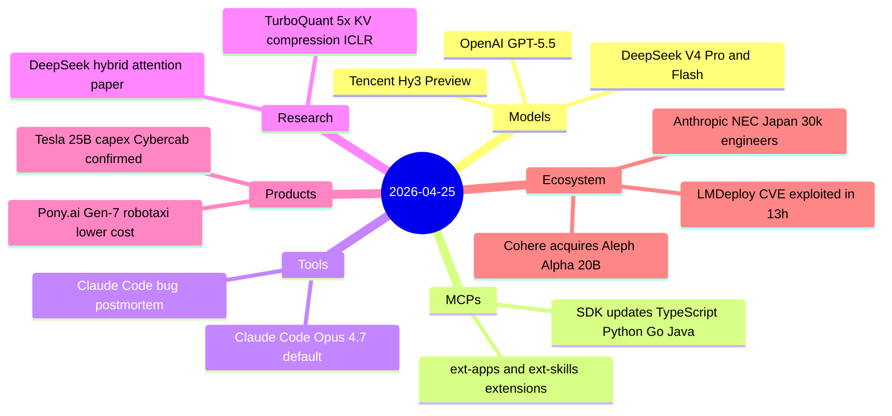
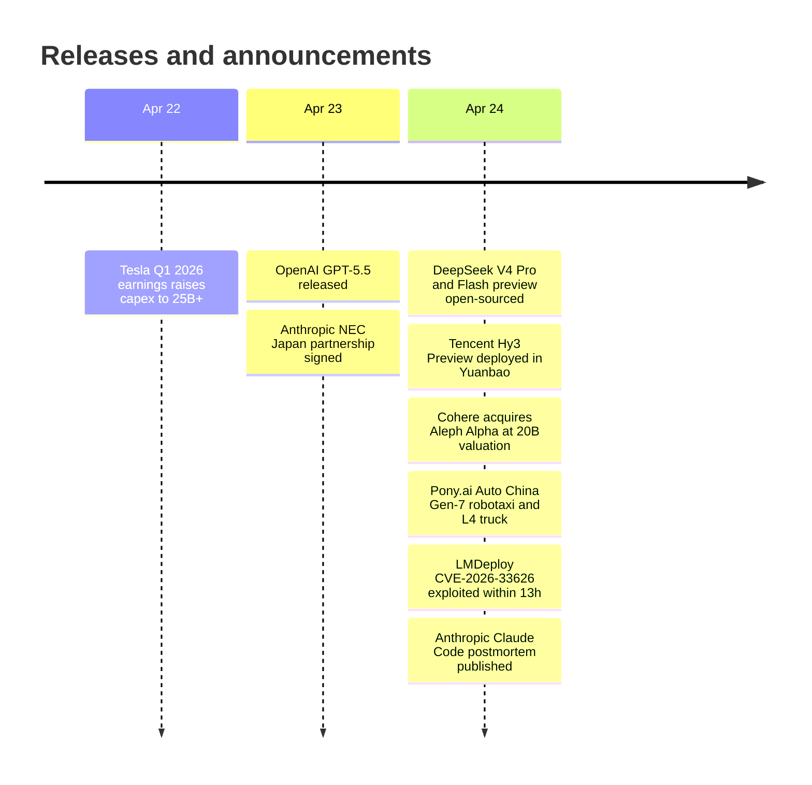

# AI Digest — 2026-04-25

> Three major model events defined the past 48 hours: OpenAI released GPT-5.5 on April 23 (the first fully retrained base model since GPT-4.5, with 1M-token context at $5/M input), and DeepSeek followed on April 24 with V4-Pro and V4-Flash — open-weight models matching near-frontier quality at $1.74/M input, 30× cheaper than GPT-5.5. Tencent added Hy3 Preview (295B MoE) the same day, replacing DeepSeek in its own consumer chatbot. On the business side, Cohere's acquisition of Germany's Aleph Alpha at a $20B combined valuation is the largest AI M&A deal of 2026 so far. The day's theme is dual: continued commoditization pressure from open-weight releases colliding with structural consolidation driven by European data-sovereignty concerns.

## Day at a glance

## Top stories

1. **DeepSeek V4-Pro / V4-Flash** — Open-weight 1.6T-param model with 1M-token context at $1.74/M input, 90% less KV cache than V3.2, open weights on Hugging Face. [→ details](models.md#deepseek-v4)
2. **Cohere acquires Aleph Alpha at $20B** — Transatlantic merger creates a sovereign-AI challenger to US frontier labs, backed by $600M from Schwarz Group's STACKIT cloud. [→ details](ecosystem.md#cohere-aleph-alpha-merger)
3. **OpenAI GPT-5.5** — First full base retrain since GPT-4.5; 82.7% Terminal-Bench 2.0, 1M-token context, $5/$30 pricing — but 86% hallucination rate on AA-Omniscience is a concern. [→ details](models.md#gpt-5-5)

## By the numbers

| Category | Items | Highlight |
|----------|------:|-----------|
| Models | 3 | DeepSeek V4-Pro: 1.6T params, $1.74/M, open weights |
| MCPs | 2 | ext-apps UI-embedding protocol + skills discovery |
| Tools | 2 | Claude Code Opus 4.7 default; harness postmortem |
| Research | 2 | DeepSeek hybrid attention: 27% FLOPs at 1M context |
| Products | 2 | Tesla $25B capex; Pony.ai unit-economics breakeven |
| Ecosystem | 4 | Cohere-Aleph Alpha $20B; LMDeploy SSRF in 13h |

## Timeline (UTC)

## Files
- [Models](models.md)
- [MCPs](mcps.md)
- [Tools](tools.md)
- [Research](research.md)
- [Products](products.md)
- [Ecosystem](ecosystem.md)
