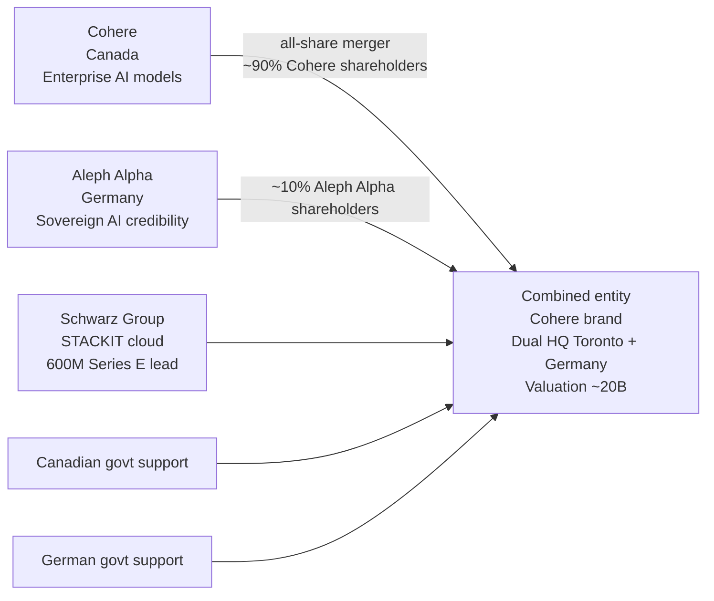

# Ecosystem — 2026-04-25

## Cohere Acquires Aleph Alpha: $20B Transatlantic Sovereign AI Merger 

**Source:** [TechCrunch](https://techcrunch.com/2026/04/24/cohere-acquires-merges-with-german-based-startup-to-create-a-transatlantic-ai-powerhouse/) · [Axios](https://www.axios.com/2026/04/24/cohere-20-billion-aleph-alpha-europe) · [Tech.eu](https://tech.eu/2026/04/24/aleph-alpha-to-be-acquired-by-cohere/) · **Type:** M&A · **Time (UTC):** Apr 24

Canadian enterprise AI company Cohere announced it is acquiring Germany's Aleph Alpha in an all-share deal that values the combined entity at approximately $20 billion. Cohere shareholders retain ~90% of the merged company; Aleph Alpha shareholders receive ~10%. Schwarz Group (investor in Aleph Alpha and owner of the STACKIT sovereign cloud platform) will invest $600M to lead Cohere's concurrent Series E. Both the Canadian and German governments are supportive of the transaction. The combined company will operate under the Cohere brand with dual headquarters in Toronto and Germany.

The strategic logic is data sovereignty: European governments and enterprises face strong procurement pressure to avoid routing sensitive data through US-based hyperscalers. Aleph Alpha has positioned itself as the canonical "European sovereign AI" vendor; Cohere brings production-grade model capabilities and enterprise sales infrastructure.

**Why it matters:** This is the largest AI M&A deal of 2026 so far and creates a credible transatlantic challenger to OpenAI and Anthropic in the enterprise segment. The $600M STACKIT commitment also signals that European cloud providers see AI sovereignty as a durable commercial opportunity worth financing at scale.

---

## Anthropic and NEC: 30,000 Employees to Use Claude Code in Japan 

**Source:** [Anthropic](https://www.anthropic.com/news/anthropic-nec) · [NEC press release](https://www.nec.com/en/press/202604/global_20260423_01.html) · **Type:** partnership · **Time (UTC):** Apr 23

NEC Corporation became Anthropic's first Japan-based Global Partner on April 23. The partnership deploys Claude (including Claude Code and Claude Cowork, an AI agent for desktop use) across approximately 30,000 NEC Group employees. NEC will establish a Center of Excellence for AI-native engineering, supported by Anthropic technical enablement and training. First-phase industry-specific solutions target finance, manufacturing, and local government in Japan. NEC is also integrating Claude into its Security Operations Center services for threat detection and response.

**Why it matters:** This is among the largest single enterprise deployments of Claude Code announced to date. Japan's enterprise technology sector adopting external AI developer tooling at this scale — and integrating it into security operations — signals that demand for AI coding tools is broadening meaningfully beyond North America and Western Europe.

---

## LMDeploy CVE-2026-33626: SSRF Flaw Exploited Within 13 Hours of Disclosure 

**Source:** [The Hacker News](https://thehackernews.com/2026/04/lmdeploy-cve-2026-33626-flaw-exploited.html) · [Sysdig](https://webflow.sysdig.com/blog/cve-2026-33626-how-attackers-exploited-lmdeploy-llm-inference-engines-in-12-hours) · **Type:** security · **Time (UTC):** Apr 24

CVE-2026-33626 (CVSS 7.5) was disclosed April 21 for LMDeploy (an open-source LLM inference toolkit). Sysdig's honeypot detected the first exploitation attempt within 12 hours 31 minutes of the GitHub advisory publication. The vulnerability is a Server-Side Request Forgery (SSRF) in `lmdeploy/vl/utils.py`: the `load_image()` function fetches arbitrary URLs without validating against private/internal IP ranges. In an 8-minute honeypot session, attackers used the image loader as an SSRF primitive to scan the internal network for AWS IMDS, Redis, MySQL, an admin HTTP interface, and an out-of-band DNS exfiltration endpoint. Fixed in LMDeploy v0.12.3 — upgrade immediately.

**Why it matters:** Sub-13-hour exploitation of an LLM inference server is consistent with a pattern observed repeatedly in AI infrastructure over the past several months. Teams self-hosting any open-source inference stack (LMDeploy, vLLM, Ollama, etc.) should treat these servers with the same security priority as public-facing web services: network segmentation, prompt patching policies, and monitoring for internal network probes.

---

## Anthropic Election Safeguards: Policy Update 

**Source:** [Anthropic news](https://www.anthropic.com/news) · **Type:** policy · **Time (UTC):** Apr 24

Anthropic published an update to its election safeguards policies on April 24. The specific changes were not detailed in the newsroom summary available at time of writing. Full details at the linked article when it becomes accessible.
