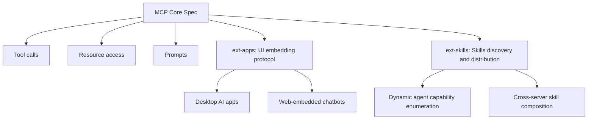

# MCPs — 2026-04-25

## MCP Organization: ext-apps and ext-skills Extensions Active 

**Source:** [MCP GitHub Organization](https://github.com/modelcontextprotocol) · **Type:** spec update · **Time (UTC):** Apr 24

The Model Context Protocol GitHub organization shows active development on two extension repositories as of April 24:

- **ext-apps**: Described as "Official repo for spec & SDK of MCP Apps protocol — standard for UIs embedded AI chatbots." This extension codifies how AI chatbots are embedded within UI applications, covering hosting, communication, and composition patterns beyond the core tool-calling and resource-access primitives.
- **experimental-ext-skills**: An experimental exploration of skills discovery and distribution through MCP primitives, aligned with an active "Skills Over MCP" working group within the organization.

Both repositories had commits on April 24. These move MCP's scope beyond server-to-model plumbing and into higher-level abstractions for how agents surface their capabilities to applications and users.

**Why it matters:** The skills discovery extension addresses a real gap: today, finding and wiring up MCP servers requires manual configuration. A standard skills-discovery layer would let agents enumerate available capabilities at runtime, which is a prerequisite for more autonomous agent composition.

---

## MCP SDKs: Coordinated Updates Across Four Languages 

**Source:** [MCP GitHub Organization](https://github.com/modelcontextprotocol) · **Type:** update · **Time (UTC):** Apr 24

All four official MCP SDKs received activity on April 24:

| SDK | Stars | Key partners |
|-----|------:|-------------|
| Python SDK | 22,800+ | — |
| TypeScript SDK | 12,278 | — |
| Go SDK | 4,429 | Google |
| Java SDK | 3,380 | Spring AI |

The Python SDK is the most widely deployed. Go and Java SDKs reflect enterprise and hyperscaler adoption (Google and the Spring/JVM ecosystem respectively). The MCP community registry (also in Go, 6,730 stars) also had recent commits. A Transports WG active in the organization points to upcoming changes in how MCP servers expose connectivity.

**Why it matters:** Coordinated multi-language SDK maintenance at this scale confirms MCP is no longer an Anthropic-only ecosystem artifact — it has broad enough adoption that Google, Spring AI, and the broader Go community are active co-maintainers.
