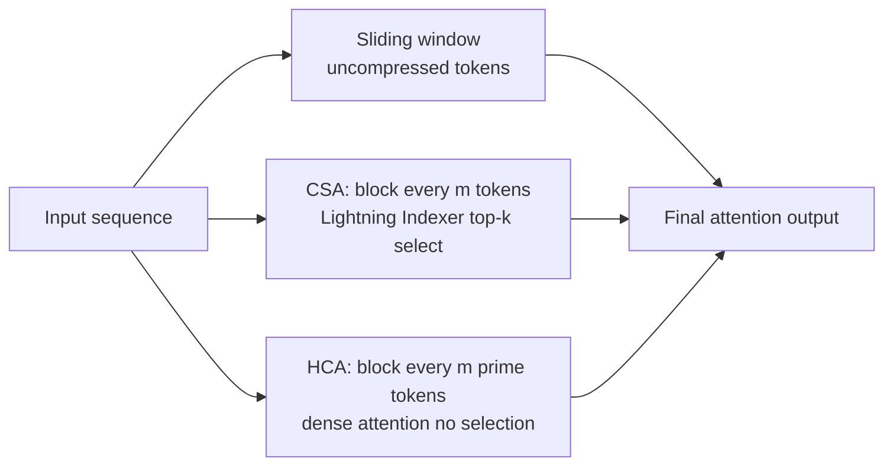

# Models — 2026-04-25

## DeepSeek V4-Pro and V4-Flash 

**Source:** [Simon Willison](https://simonwillison.net/2026/Apr/24/deepseek-v4/) · [Al Jazeera](https://www.aljazeera.com/economy/2026/4/24/chinas-deepseek-unveils-latest-model-a-year-after-upending-global-tech) · [Euronews](https://www.euronews.com/next/2026/04/24/chinas-deepseek-releases-new-ai-model-v4-heres-everything-to-know-as-the-ai-race-speeds-up) · **Type:** release · **Time (UTC):** ~06:00

DeepSeek released preview versions of two new models on April 24: V4-Pro (1.6 trillion total parameters / 49 billion active per token, pretrained on 33 trillion tokens) and V4-Flash (284 billion total / 13 billion active). Both ship with 1M-token context windows enabled by a new Hybrid Compressed Attention mechanism. The Pro variant beats all open-source rivals on maths and coding benchmarks and falls only marginally short of GPT-5.4 and Gemini 3.1 Pro. Both models are available as open weights on Hugging Face. The release arrives one year after DeepSeek-R1 disrupted the AI cost narrative in January 2025.

**Why it matters:** V4-Pro is likely the largest open-weight model now available. Its pricing at $1.74/M input tokens undercuts every comparable closed-source offering by a large margin, and the open-weight release means on-prem deployment is possible — directly repeating the cost-pressure dynamic of the original V3 drop.

| Model | Total params | Active params | Context | Input $/M | Output $/M |
|-------|-------------|---------------|---------|-----------|------------|
| V4-Flash | 284B | 13B | 1M | $0.14 | ~$0.28 |
| V4-Pro | 1.6T | 49B | 1M | $1.74 | $3.48 |

**Architecture highlight — Hybrid Compressed Attention:**

At 1M-token context, V4-Pro requires only 27% of single-token FLOPs and 10% of KV cache compared to V3.2 — the efficiency gains that make consumer-cluster self-hosting plausible.

---

## OpenAI GPT-5.5 

**Source:** [TechCrunch](https://techcrunch.com/2026/04/23/openai-chatgpt-gpt-5-5-ai-model-superapp/) · [CNBC](https://www.cnbc.com/2026/04/23/openai-announces-latest-artificial-intelligence-model.html) · [ofox.ai breakdown](https://ofox.ai/blog/gpt-5-5-release-guide-2026/) · **Type:** release · **Time (UTC):** Apr 23

OpenAI launched GPT-5.5 on April 23 — described as its first fully retrained base model since GPT-4.5 (the 5.1–5.4 series were post-training iterations). The model ships with a 1M-token context window for API users and is explicitly optimized for agentic, multi-step workflows. Terminal-Bench 2.0 score of 82.7% (13 points ahead of Claude Opus 4.7) and GDPval knowledge-work score of 84.9% are the headline benchmarks. Codex limits context to 400K tokens for throughput reasons. Rolling out immediately to ChatGPT Plus, Pro, Business, and Enterprise; API access to follow.

Pricing doubles from GPT-5.4: $5/$30 per million input/output tokens. A notable caveat: elevated hallucination rate of 86% on AA-Omniscience benchmarks vs. Claude Opus 4.7's 36%, and GPT-5.5 underperforms on SWE-Bench Pro (58.6% vs. 64.3%). The base retrain — rather than post-training iteration — signals the jump is larger than the version number suggests, particularly for multi-step agent workflows.

**Why it matters:** A full base retrain mid-cycle is architecturally significant. The agentic-first design and terminal automation benchmarks indicate a clear targeting of developer and enterprise automation workloads. The hallucination caveat is a material risk for fact-sensitive production use.

| Benchmark | GPT-5.5 | Claude Opus 4.7 | Note |
|-----------|---------|-----------------|------|
| Terminal-Bench 2.0 | 82.7% | 69.7% | GPT-5.5 leads |
| GDPval | 84.9% | — | knowledge work |
| SWE-Bench Pro | 58.6% | 64.3% | Opus 4.7 leads |
| AA-Omniscience (↓ = better) | 86% | 36% | hallucination rate |

---

## Tencent Hy3 Preview 

**Source:** [Caixin Global](https://www.caixinglobal.com/2026-04-24/tech-brief-april-24-tencent-unveils-first-major-ai-model-update-under-new-leadership-102437622.html) · **Type:** release · **Time (UTC):** Apr 24

Tencent launched Hy3 Preview, a mixture-of-experts model with 295 billion total parameters and 21 billion active per token, supporting a 256K-token context window. The model is already deployed as the primary backend for Yuanbao, Tencent's flagship consumer AI chatbot, replacing DeepSeek's model. The release is framed as the first significant output from Tencent's AI team following a leadership overhaul, with the emphasis on practical product integration rather than benchmark maximization.

**Why it matters:** Tencent has historically leaned on third-party models (primarily DeepSeek) for consumer products. Deploying Hy3 at Yuanbao scale signals a strategic shift toward in-house model self-sufficiency — reducing external dependency while protecting proprietary data from flowing through a competitor's infrastructure.
