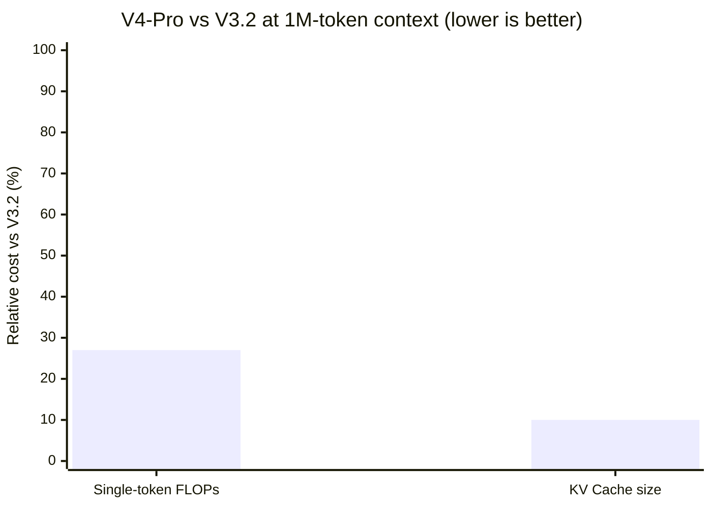

# Research — 2026-04-25

## DeepSeek V4: Hybrid Compressed Attention at 1M-Token Context 

**Source:** [DeepSeek technical report via Simon Willison](https://simonwillison.net/2026/Apr/24/deepseek-v4/) · [Digital Applied](https://www.digitalapplied.com/blog/deepseek-v4-preview-launch-1m-context-efficiency) · **Type:** paper · **Time (UTC):** Apr 24

DeepSeek released a technical report alongside V4's model preview. The central contribution is a Hybrid Compressed Attention (HCA + CSA) system designed to make 1M-token context tractable at production inference costs.

**Compressed Sparse Attention (CSA):** Every m tokens are aggregated into a single KV block. A learned Lightning Indexer scores blocks and selects the top-k most relevant, with a sliding window of recent uncompressed tokens appended to preserve local dependencies.

**Heavy Compressed Attention (HCA):** More aggressive compression — every m′ tokens (m′ ≫ m) fold into one KV entry, with dense attention over the compressed KV and no sparse selection step. Trades precision for throughput in distant-context retrieval.

Additional innovations: manifold-constrained hyper-connections (mHC) replacing standard residual connections; the Muon optimizer accelerating training convergence; Multi-Token Prediction (MTP) retained from V3.

**Results:** At 1M-token context, V4-Pro requires 27% of single-token FLOPs and 10% of KV cache vs. DeepSeek-V3.2.

**Why it matters:** A 10× reduction in KV cache at 1M tokens is the difference between self-hosted long-context inference being theoretically possible and practically affordable on consumer GPU clusters. This architectural template is likely to be replicated in other open-weight long-context models.

---

## TurboQuant: 5× KV Cache Compression (ICLR 2026) 

**Source:** [devFlokers research roundup](https://www.devflokers.com/blog/new-ai-papers-arxiv-last-24-hours-april-2026) · **Type:** paper · **Time (UTC):** —

Google Research presented TurboQuant at ICLR 2026 (conference runs April 27 – May 1), achieving approximately 5× compression of the KV cache with minimal accuracy loss. The algorithm proceeds in two steps: **PolarQuant** applies a random rotation to data vectors to simplify their geometric structure, followed by **QJL** (Quantized Johnson-Lindenstrauss) compression that uses a single residual bit as a mathematical error-checker. A companion technique from MIT, **CompreSSM**, extends similar compression benefits to state-space model (SSM) architectures beyond Transformers.

**Why it matters:** KV cache is a dominant factor in LLM inference cost and GPU memory at scale. A reproducible 5× reduction translates directly into either 5× more concurrent requests or 5× longer usable context for the same hardware budget. The SSM extension is notable as non-Transformer architectures gain traction.
