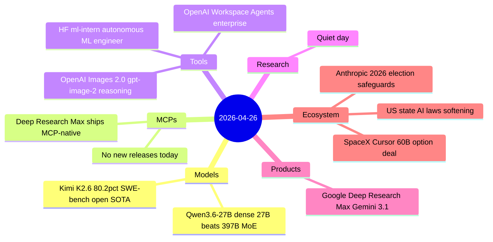
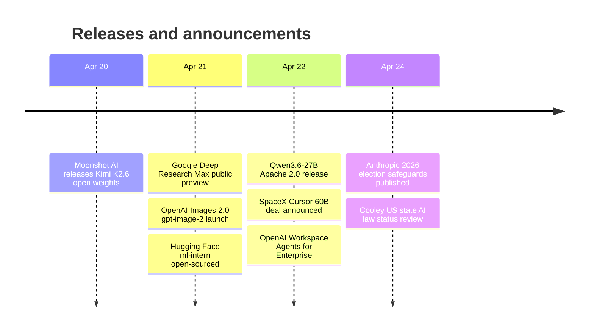

# AI Digest — 2026-04-26

> April 26 is a lighter news day following the week's dense release schedule. The two headline model releases — Moonshot AI's Kimi K2.6 (80.2% SWE-bench Verified, 300-agent swarms) and Alibaba's Qwen3.6-27B (77.2% SWE-bench, dense 27B beating its own 397B MoE) — both shipped earlier this week and weren't captured in yesterday's digest. The business lead is SpaceX's $60B acquisition option on Cursor, the largest potential developer-tools deal ever, structured around SpaceX's Colossus supercomputer. Google Deep Research Max rounds out the week with the first enterprise async research agent in the Gemini API, complete with MCP-native private-data connectivity.

## Day at a glance

## Top stories

1. **Kimi K2.6 sets open-source SWE-bench Verified record at 80.2%** — Moonshot AI's 1T-param MoE (32B active) leads all open-weight models on agentic coding, with a novel agent-swarm mode coordinating up to 300 sub-agents. [→ details](models.md#kimi-k2-6)
2. **SpaceX takes $60B acquisition option on Cursor** — A $10B collaboration deal preempted Cursor's $2B fundraise; SpaceX plans to finance the full buyout with post-IPO stock, potentially making this the largest developer-tools acquisition ever. [→ details](ecosystem.md#spacex-cursor-deal)
3. **Google Deep Research Max launches on Gemini 3.1 Pro** — The async enterprise research agent scores 93.3% on DeepSearchQA, generates inline charts, and connects to private data via MCP — the first GA product in the Gemini API to bundle MCP as a first-class feature. [→ details](products.md#google-deep-research-max)

## By the numbers

| Category | Items | Highlight |
|----------|------:|-----------|
| Models | 2 | Kimi K2.6: 80.2% SWE-bench Verified, open weights |
| MCPs | 0 | No releases; Deep Research Max adds MCP support |
| Tools | 3 | HF ml-intern: 32% GPQA vs 23% for Claude Code |
| Research | 0 | Quiet day; architectural novelty in Qwen3.6 |
| Products | 1 | Deep Research Max: 93.3% DeepSearchQA |
| Ecosystem | 3 | SpaceX/Cursor $60B; state AI law rollbacks |

## Timeline (UTC)

## Files
- [Models](models.md)
- [MCPs](mcps.md)
- [Tools](tools.md)
- [Research](research.md)
- [Products](products.md)
- [Ecosystem](ecosystem.md)
