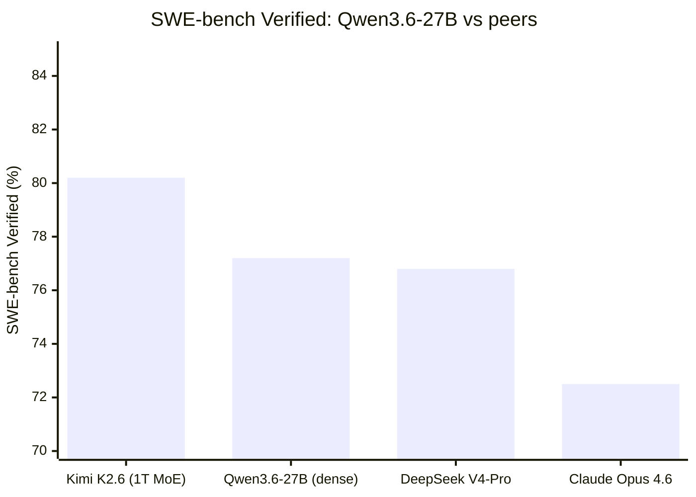
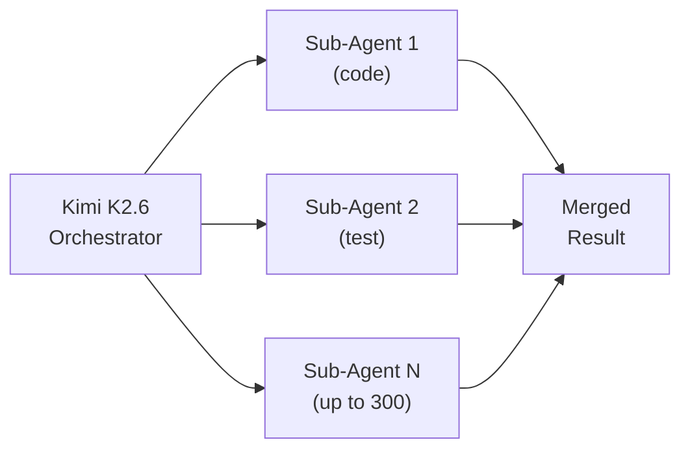

# Models — 2026-04-26

## Qwen 3.6-27B: Dense Architecture Beats Its Own MoE Flagship 

**Source:** [Qwen Team / Alibaba](https://huggingface.co/Qwen/Qwen3.6-27B) · **Type:** release · **Time (UTC):** April 22

Alibaba's Qwen team released Qwen3.6-27B, a 27B dense multimodal model that outperforms the previous Qwen3.5-397B-A17B MoE on coding and agentic benchmarks. The model uses a novel hybrid architecture alternating Gated DeltaNet linear-attention layers (48 per block) with standard grouped-query attention (24Q/4KV), enabling efficient long-context inference. Native context is 262K tokens, extensible to ~1M via YaRN scaling. The license is Apache 2.0.

**Key benchmarks:**

| Benchmark | Qwen3.6-27B | Qwen3.5-397B-A17B |
|---|---|---|
| SWE-bench Verified | 77.2% | 76.2% |
| SWE-bench Pro | 53.5% | — |
| Terminal-Bench 2.0 | 59.3% | — |
| GPQA Diamond | 87.8% | — |
| AIME 2026 | 94.1% | — |
| MMMU | 82.9% | — |

**Why it matters:** A single dense 27B model—runnable on a single A100 80GB or two RTX 3090s—now matches or exceeds a 397B MoE on SWE-bench. This directly lowers the hardware floor for frontier-class agentic coding in local and self-hosted deployments.

---

## Kimi K2.6: New Open-Source SWE-bench Leader with 300-Agent Swarms 

**Source:** [Moonshot AI / HuggingFace](https://huggingface.co/moonshotai/Kimi-K2.6) · **Type:** release · **Time (UTC):** April 20 ~08:00

Moonshot AI released Kimi K2.6, a 1T-parameter MoE model with 32B active parameters, setting a new open-source record on SWE-bench Verified at 80.2%. The architecture uses Multi-head Latent Attention (MLA) across 61 layers (1 dense + 60 MoE), with 384 experts and 8 selected per token, a 256K native context window, and a 400M MoonViT encoder for vision. Weights are released under a Modified MIT license and available on Hugging Face; inference is supported via vLLM, SGLang, and KTransformers.

A novel "Elevated Agent Swarm" mode coordinates up to 300 specialized sub-agents across 4,000 coordinated steps, enabling persistent background agent jobs.

**Key benchmarks:**

| Benchmark | Kimi K2.6 | GPT-5.4 | Claude Opus 4.6 |
|---|---|---|---|
| SWE-bench Verified | **80.2%** | 78.1% | 72.5% |
| SWE-bench Pro | **58.6%** | 57.7% | — |
| Terminal-Bench 2.0 | **66.7%** | 65.4% | 65.4% |
| BrowseComp | 83.2% | — | — |
| AIME 2026 | 96.4% | — | — |
| GPQA Diamond | 90.5% | — | — |

**Why it matters:** Kimi K2.6 takes the SWE-bench Verified top spot among open-weight models by 2.1 points over Qwen3.6-27B, while also introducing a production-ready swarm scheduling API. For teams building autonomous coding pipelines, this offers frontier-class performance without proprietary API lock-in.

---
