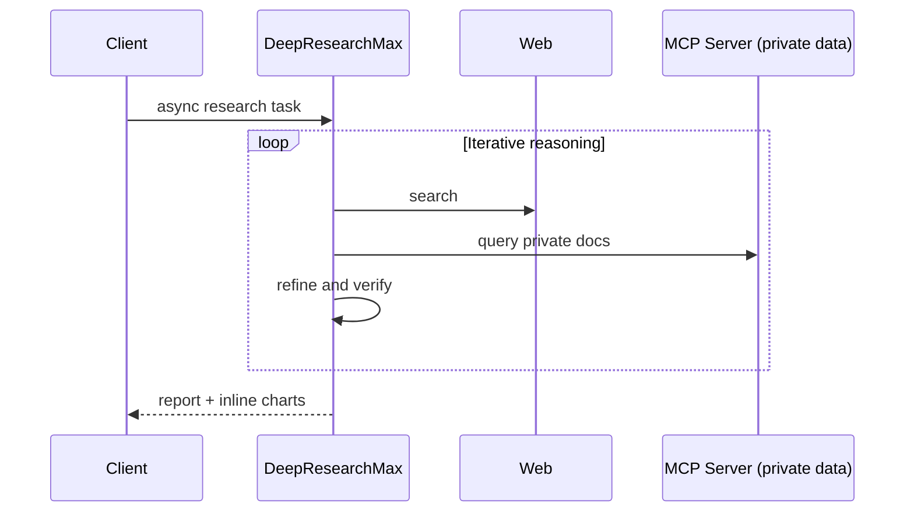

# Products — 2026-04-26

## Google Deep Research and Deep Research Max 

**Source:** [Google Blog](https://blog.google/innovation-and-ai/models-and-research/gemini-models/next-generation-gemini-deep-research/) · **Type:** launch · **Time (UTC):** April 21

Google launched two autonomous research agents via the Gemini API, both powered by Gemini 3.1 Pro. The tier structure separates latency-optimized and quality-optimized workloads:

| | Deep Research | Deep Research Max |
|---|---|---|
| Compute mode | Standard | Extended test-time |
| Latency | Interactive | Async / batch |
| Best for | Inline research widgets | Overnight due-diligence reports |
| DeepSearchQA F1 | 91.4% | **93.3%** |

Both agents support MCP connections, enabling secure queries against private databases and internal document repositories without data leaving source systems. Native chart and infographic generation is built in — the first GA offering in the Gemini API to produce HTML and SVG visualizations inline with report text. Access is available in public preview through paid tiers of the Gemini API via the Interactions API.

**Why it matters:** Deep Research Max's extended compute mode and MCP integration position it directly against OpenAI's Deep Research and Perplexity's enterprise product for finance, life sciences, and market intelligence workflows where overnight batch quality is acceptable and proprietary data must stay on-premises.

---
