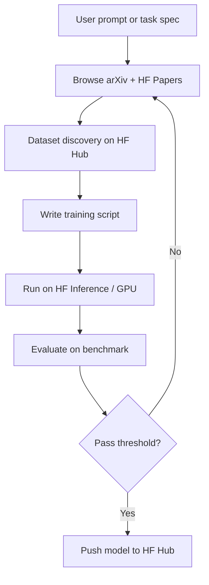

# Tools — 2026-04-26

## Hugging Face ml-intern: Autonomous ML Engineering Agent 

**Source:** [Hugging Face / GitHub](https://github.com/huggingface/ml-intern) · **Type:** release · **Time (UTC):** April 21–25 (trending April 25–26)

Hugging Face open-sourced ml-intern, a CLI and web app that automates the full LLM post-training loop: it browses arXiv and Hugging Face Papers, traverses citation graphs, discovers and cleans datasets from the Hub, writes training scripts, runs experiments on provisioned GPU compute, and evaluates results — all without human intervention between steps. Built on the smolagents framework, it has deep ecosystem access to HF Hub APIs, Inference Endpoints, and the Spaces compute tier.

In published demonstrations, the agent improved Qwen3-1.7B from 10% to 32% accuracy on GPQA in under 10 hours, compared to 22.99% achieved by Claude Code on the same task. On a separate healthcare benchmark, it autonomously generated 1,100 synthetic training examples and outperformed Codex on HealthBench by 60%. Hugging Face is provisioning $1,000 in GPU credits and Anthropic API credits for early users.

**Why it matters:** ml-intern operationalizes the research-to-deployment loop that typically takes ML engineers days or weeks. As the highest-gaining AI repo on GitHub trending on April 25–26 (+1,240 stars/day), it signals strong practitioner interest in fully automated fine-tuning pipelines.

---

## OpenAI ChatGPT Images 2.0 (gpt-image-2) 

**Source:** [OpenAI](https://openai.com/index/introducing-chatgpt-images-2-0/) · **Type:** release · **Time (UTC):** April 21

OpenAI shipped gpt-image-2 under the ChatGPT Images 2.0 brand. Unlike the previous DALL-E 3 backend, gpt-image-2 applies a reasoning step before generating — it can search the web, plan multi-image compositions, and verify its own output before delivery. Resolution is 2K native. The model renders dense multilingual text (Japanese, Korean, Chinese, Hindi, Bengali) in-image accurately for the first time, enabling use cases like marketing assets, UI mockups, and manga panels. It scored first across all categories in the image generation Elo rankings, leading by +242 Elo points over the nearest competitor.

**Why it matters:** Accurate text-in-image generation has been the persistent failure mode of diffusion models for three years. The reasoning-before-drawing architecture resolves it at production quality, removing a blocker for localized content workflows and in-app UI prototyping.

---

## OpenAI Workspace Agents for ChatGPT Enterprise 

**Source:** [OpenAI](https://openai.com/news/) · **Type:** release · **Time (UTC):** April 22

OpenAI launched Workspace Agents, a no-code agent builder for ChatGPT Enterprise and Business tiers. Admins can define shared agents with specific tool access (web search, code execution, file retrieval, integrations), publish them to workspaces, and set per-tool permission levels. Agents are off by default and must be explicitly published by workspace admins. The system targets teams who want shared AI workflows without engineering overhead — a direct response to Microsoft Copilot Studio and Salesforce Agentforce for enterprise buyers.

**Why it matters:** Moving agent creation from developers to workspace admins accelerates enterprise AI adoption and creates stickiness for OpenAI's B2B tier. Combined with GPT-5.5 shipping the same week, OpenAI is consolidating its enterprise position before competitors finalize their agent platforms.

---
