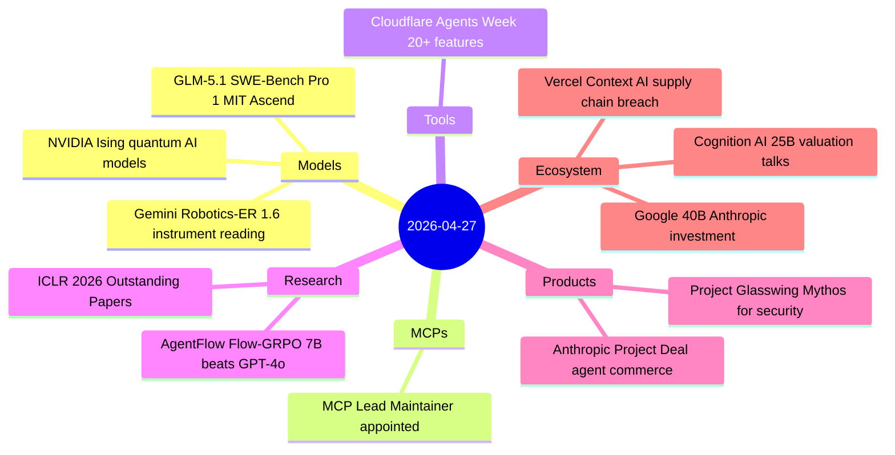
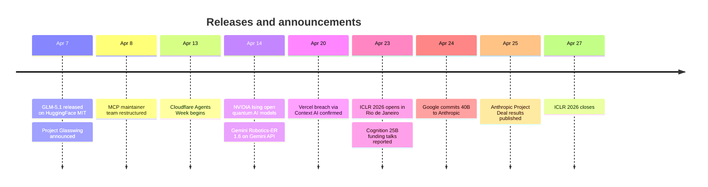

# AI Digest — 2026-04-27

> A catch-up digest surfacing stories that slipped through while the week's dense model release cycle dominated the feed. The headline is Google's commitment of up to $40 billion to Anthropic (April 24) — the largest single investor commitment to an AI lab — bringing the combined Google + Amazon compute pledge to roughly 10 gigawatts and validating Anthropic's $30B annualized-revenue run rate. ICLR 2026 concluded today in Rio de Janeiro, with AgentFlow/Flow-GRPO (oral, top 1.1%) showing a 7B model beating GPT-4o by 14–17% on search and math tasks through a novel multi-turn policy optimization technique. Z.ai's GLM-5.1 claimed #1 on SWE-Bench Pro under an MIT license — and is the only frontier-scale open model trained entirely on Huawei Ascend silicon. Anthropic's Project Glasswing and Project Deal round out the week's AI product story: the former withholds its most capable model from public release to route it defensively to security partners; the latter reveals that agent model quality matters far more than prompt instructions in agent-to-agent commerce.

## Day at a glance

## Top stories

1. **Google commits up to $40B to Anthropic** — $10B in immediate cash plus up to $30B contingent, adding 5GW Google Cloud compute to the existing Amazon commitment; Anthropic's infrastructure now backed by two hyperscalers at 10GW combined. [→ details](ecosystem.md#google-anthropic-40b)
2. **Anthropic Project Glasswing: Mythos withheld, deployed only for defense** — Mythos Preview found thousands of zero-days including a 27-year-old OpenBSD bug; Anthropic committed $100M in usage credits to security partners and chose not to release the model publicly. [→ details](products.md#project-glasswing)
3. **AgentFlow / Flow-GRPO wins ICLR 2026 Oral** — A 7B model trained with a novel multi-turn credit-assignment technique outperforms GPT-4o by 14–17% on search, math, and science tasks; standard SFT on the same data causes a 19% collapse. [→ details](research.md#agentflow-flow-grpo)

## By the numbers

| Category   | Items | Highlight |
|------------|------:|-----------|
| Models     |     3 | GLM-5.1: 58.4% SWE-Bench Pro, MIT, Huawei Ascend |
| MCPs       |     1 | Den Delimarsky → Lead Maintainer |
| Tools      |     1 | Cloudflare: unified inference across 14+ providers |
| Research   |     2 | AgentFlow: 7B beats GPT-4o, ICLR oral top 1.1% |
| Products   |     2 | Project Deal: Opus >> Haiku in agent commerce |
| Ecosystem  |     3 | Google $40B + Amazon $25B → Anthropic 10GW total |

## Timeline (UTC)

## Files
- [Models](models.md)
- [MCPs](mcps.md)
- [Tools](tools.md)
- [Research](research.md)
- [Products](products.md)
- [Ecosystem](ecosystem.md)
