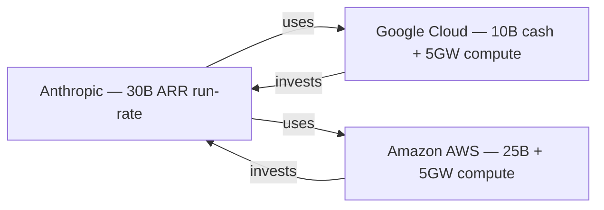

# Ecosystem — 2026-04-27

## Google commits up to $40 billion to Anthropic in cash and compute 

**Source:** [TechCrunch](https://techcrunch.com/2026/04/24/google-to-invest-up-to-40b-in-anthropic-in-cash-and-compute/) · [Bloomberg](https://www.bloomberg.com/news/articles/2026-04-24/google-plans-to-invest-up-to-40-billion-in-anthropic) · **Type:** funding · **Time (UTC):** Apr 24 —

Google (Alphabet) announced a commitment of up to $40 billion in Anthropic, structured as $10 billion in immediate cash at a $350 billion valuation, with up to $30 billion contingent on performance milestones. The deal includes 5 gigawatts of Google Cloud compute over five years. Anthropic's annualized revenue surpassed $30 billion this month, up from roughly $9 billion at end-2025. The investment follows Amazon's earlier $25 billion commitment and a $4B Anthropic-Amazon compute deal expanding to 5GW, bringing the combined Google + Amazon compute commitment to approximately 10 gigawatts.

Separately, a Bloomberg report published around the same time noted that Google founder Sergey Brin assembled a "strike team" within DeepMind — led by Sebastian Borgeaud — to close the coding-capability gap with Anthropic, suggesting the investment is accompanied by internal competitive pressure rather than a pure financial bet.

**Why it matters:** The combined $65B+ investor commitment from two cloud hyperscalers to a single AI lab is structurally unusual — it creates a situation where Google and Amazon are simultaneously funding Anthropic's compute costs, competing against its products, and using Claude in their own platforms. For engineers evaluating AI vendor lock-in, this level of infrastructure entanglement makes Anthropic's long-term API access more stable than most independent AI providers.

---

## Cognition AI (Devin) in funding talks at $25 billion valuation 

**Source:** [Bloomberg](https://www.bloomberg.com/news/articles/2026-04-23/ai-coding-firm-cognition-in-funding-talks-at-25-billion-value) · [SiliconANGLE](https://siliconangle.com/2026/04/23/cognition-creator-ai-software-engineer-devin-talks-raise-hundreds-millions-25b-valuation/) · **Type:** funding · **Time (UTC):** Apr 23 —

Cognition AI — maker of Devin, the AI software engineer — is in early talks to raise hundreds of millions of dollars at a $25 billion valuation, more than doubling its September 2025 valuation of $10.2 billion. The company grew ARR from $1 million in September 2024 to $73 million by June 2025. No investors or final terms were announced; negotiations are ongoing.

**Why it matters:** The valuation trajectory ($4B → $10.2B → $25B in roughly 18 months) reflects the market's belief that "AI SWE" products have durable revenue, not just hype demand. Cognition competes directly with Claude Code, Cursor, and GitHub Copilot Workspace — its ability to raise at this level signals continued investor appetite for standalone coding-agent businesses separate from the foundation model layer.

---

## Vercel breached via Context AI OAuth supply-chain attack 

**Source:** [TechCrunch](https://techcrunch.com/2026/04/20/app-host-vercel-confirms-security-incident-says-customer-data-was-stolen-via-breach-at-context-ai/) · [Bleeping Computer](https://www.bleepingcomputer.com/news/security/vercel-confirms-breach-as-hackers-claim-to-be-selling-stolen-data/) · [Trend Micro](https://www.trendmicro.com/en_us/research/26/d/vercel-breach-oauth-supply-chain.html) · **Type:** security incident · **Time (UTC):** Apr 20 (confirmed) —

Vercel confirmed that attackers accessed internal systems and obtained credentials of a "limited subset of customers" via a multi-stage supply chain attack. The attack chain: a Context.ai employee's laptop was infected with Lumma Stealer malware (traced to a Roblox cheat-download in February), yielding credentials that were later used to compromise a Vercel engineer's Google Workspace account, then their Vercel account, then a Vercel environment where non-sensitive environment variables were enumerated and decrypted.

The ShinyHunters threat actor group has claimed responsibility and listed the stolen data for sale at $2 million. Vercel engaged Google Mandiant and confirmed with GitHub, Microsoft, npm, and Socket that no Vercel-published npm packages were tampered with. Crypto developers dependent on Vercel-hosted infrastructure scrambled to rotate API keys.

**Why it matters:** This attack chain illustrates the OAuth/environment-variable attack surface created when enterprise developer tools (Vercel, Context.ai) store cloud provider credentials as environment variables in shared sessions. Engineers should audit third-party AI tools that have access to production credentials — the weakest link is now often a vendor's employee machine, not the primary platform.

---
