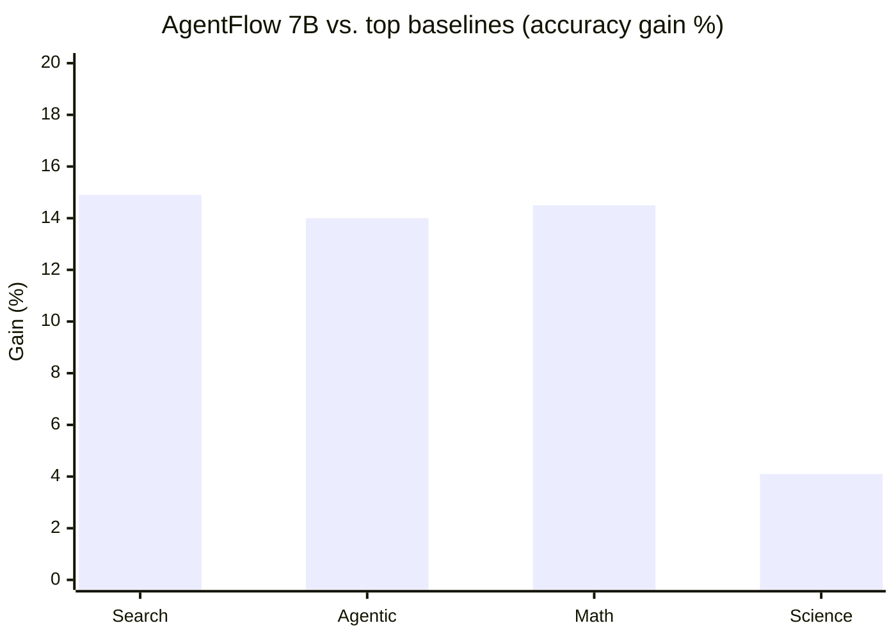

# Research — 2026-04-27

## AgentFlow / Flow-GRPO: 7B model outperforms GPT-4o on agentic tasks (ICLR 2026 Oral) 

**Source:** [AgentFlow (Stanford)](https://agentflow.stanford.edu/) · [OpenReview](https://openreview.net/forum?id=Mf5AleTUVK) · **Type:** paper · **Time (UTC):** Apr 23 (ICLR presentation) —

Presented as an ICLR 2026 Oral (top 1.1% of submissions), AgentFlow proposes a trainable, in-the-flow agentic framework coordinating four modules — planner, executor, verifier, generator — through shared memory. The key training contribution is Flow-GRPO (Flow-based Group Refined Policy Optimization), which converts long-horizon multi-turn optimization into a sequence of tractable single-turn policy updates by broadcasting a single trajectory-level outcome to every decision step.

A 7B-scale model trained with Flow-GRPO achieves average accuracy gains of +14.9% on search tasks, +14.0% on agentic tasks, +14.5% on mathematical reasoning, and +4.1% on scientific tasks versus top baselines, surpassing GPT-4o. Critically, standard offline Supervised Fine-Tuning on the same data causes a 19.0% performance collapse, while Flow-GRPO yields a 17.2% improvement — a 36-point swing.

**Why it matters:** Flow-GRPO addresses the credit-assignment problem in agent training without requiring reward models for every intermediate step. Engineers building custom agents can apply the technique to any 7B+ model, potentially avoiding the cost of frontier API calls for planning-heavy pipelines.

---

## ICLR 2026 Outstanding Papers: transformers, multi-turn degradation, and a physics honorable mention 

**Source:** [ICLR Blog](https://blog.iclr.cc/2026/04/23/announcing-the-iclr-2026-outstanding-papers/) · **Type:** paper · **Time (UTC):** Apr 23 (announced); conference runs Apr 23-27 in Rio de Janeiro —

ICLR 2026 (19,797 submissions, held April 23–27 in Rio de Janeiro) named two Outstanding Papers and one Honorable Mention.

**Outstanding Paper 1 — "Transformers are Inherently Succinct"** (Bergsträßer, Cotterell, Lin): A theoretical argument for why the Transformer architecture is unusually powerful, framed as a succinctness advantage over RNNs and other sequence models. The paper shows that concepts requiring exponentially long RNN programs can be expressed compactly in a single Transformer layer.

**Outstanding Paper 2 — "LLMs Get Lost In Multi-Turn Conversation"** (Microsoft Research + Salesforce): An empirical study demonstrating systematic degradation in LLM response quality as conversation depth increases, independent of context length. The paper proposes that current instruction-following training does not expose models to enough multi-turn pressure and identifies specific failure modes (context drift, instruction forgetting) that practitioners can audit.

**Honorable Mention — "The Polar Express"** (NYU + Flatiron Institute): Work combining ML with physics; details were not publicly available at press time.

**Why it matters:** "LLMs Get Lost" has direct engineering implications — it suggests that long-running agentic loops with tool-call-heavy histories may silently degrade. The paper provides a diagnostic framework developers can use to test their pipelines for multi-turn quality loss.

---
