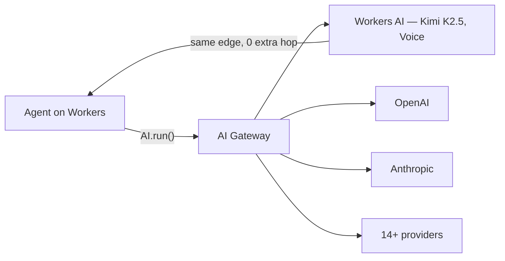

# Tools — 2026-04-27

## Cloudflare Agents Week 2026: unified inference layer and 20+ new agent features 

**Source:** [Cloudflare Blog](https://blog.cloudflare.com/agents-week-in-review/) · **Type:** release · **Time (UTC):** Apr 13-17 —

Cloudflare ran a week-long release sprint (April 13–17) shipping over 20 features targeting production AI agent deployments. The headline announcement is a unified inference layer: a single `AI.run()` binding that routes to any of 14+ model providers — including OpenAI, Anthropic, and Workers AI-hosted open models — with no extra network hop when inference and application code run on the same edge node. The company also launched Agent Lee, a conversational interface to the Cloudflare stack, and published latency benchmarks showing that collocating inference with Workers code reduces first-token latency by 50ms compared to a round-trip to an external provider endpoint.

Workers AI now hosts Kimi K2.5 and real-time voice models. AI Gateway expanded to support multi-provider fallback routing and per-provider rate-limit enforcement. Cloudflare internally ran 20 million requests and 241 billion tokens through the new stack during the launch window.

**Why it matters:** For engineers building real-time agents, the 50ms latency reduction and zero-hop inference changes what's feasible in interactive workflows (sub-200ms end-to-end responses). The provider-neutral `AI.run()` API also simplifies model-swapping experiments without rewriting application logic.

---
