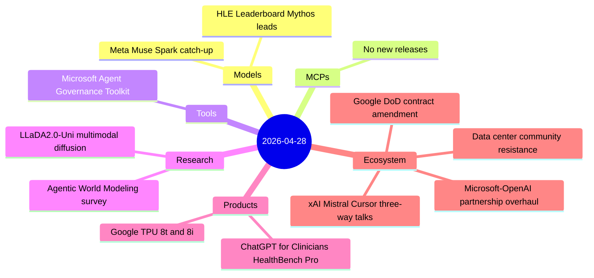
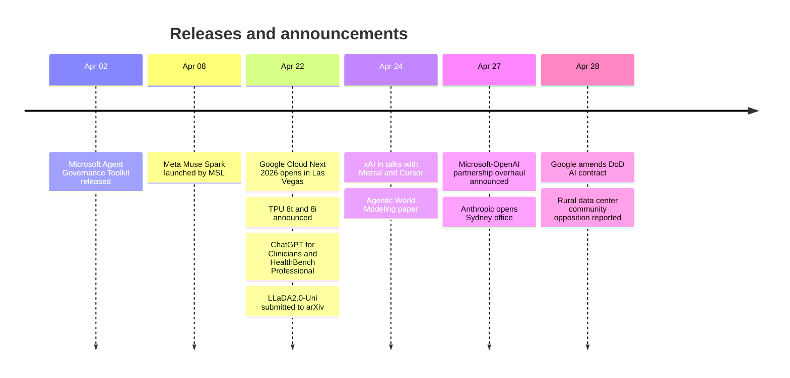

# AI Digest — 2026-04-28

> The defining story of the April 28 cycle is Microsoft and OpenAI's sweeping partnership restructuring (April 27): Microsoft ends its revenue-share payments to OpenAI, the IP license shifts from exclusive to non-exclusive through 2032, and OpenAI is now free to sell products on AWS and Google Cloud — defusing potential litigation over OpenAI's $50 B Amazon deal and ending years of Azure exclusivity. A second thread runs through Google Cloud Next 2026 (April 22–24), which delivered the eighth-generation TPU 8t/8i hardware and ChatGPT for Clinicians with the HealthBench Professional benchmark in the same week. This digest also catches up on Meta's quiet proprietary pivot: Muse Spark (April 8, not covered in prior digests) is Meta's first non-open-weights model, trained by Meta Superintelligence Labs and scoring 58 % on Humanity's Last Exam. Rounding out the day: a Google DoD contract amendment allowing AI use "for any lawful government purpose" and growing community resistance to rural data center expansion.

## Day at a glance

## Top stories

1. **Microsoft and OpenAI gut their exclusive deal** — Revenue share ends, IP license goes non-exclusive, OpenAI can now sell on any cloud; the AGI clause is formally removed. [→ details](ecosystem.md#microsoft-openai-overhaul)
2. **Google TPU 8t & 8i: 8th-gen chips for the agentic era** — Dual-chip architecture splits training (121 ExaFlops, 3× prev-gen) and inference (80 % better perf/dollar) into dedicated silicon. [→ details](products.md#google-tpu-8t-8i)
3. **ChatGPT for Clinicians + HealthBench Professional** — Free access for verified US clinicians (NPI required) paired with a new open benchmark for clinician-facing tasks across three domains. [→ details](products.md#chatgpt-clinicians)

## By the numbers

| Category   | Items | Highlight |
|------------|------:|-----------|
| Models     |     1 | Muse Spark: 58% HLE, first proprietary Meta model |
| MCPs       |     0 | No new releases |
| Tools      |     1 | Agent Governance Toolkit: OWASP Agentic Top 10, <0.1 ms |
| Research   |     2 | LLaDA2.0-Uni: discrete diffusion unifies text + image |
| Products   |     2 | TPU 8i: 80% better perf/dollar vs Ironwood |
| Ecosystem  |     4 | MS-OpenAI deal: multi-cloud, AGI clause gone |

## Timeline (UTC)

## Files
- [Models](models.md)
- [MCPs](mcps.md)
- [Tools](tools.md)
- [Research](research.md)
- [Products](products.md)
- [Ecosystem](ecosystem.md)
