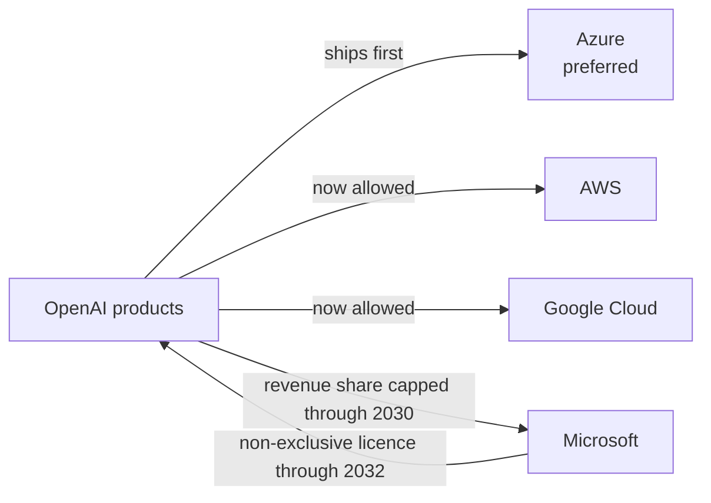

# Ecosystem — 2026-04-28

## Microsoft and OpenAI Restructure Their Partnership 

**Source:** [Microsoft Blog](https://blogs.microsoft.com/blog/2026/04/27/the-next-phase-of-the-microsoft-openai-partnership/) · [OpenAI](https://openai.com/index/next-phase-of-microsoft-partnership/) · **Type:** business · **Time (UTC):** April 27, 2026

Microsoft and OpenAI announced a comprehensive amendment to their multi-year partnership that removes several foundational exclusivity provisions. Microsoft will no longer pay a revenue share to OpenAI (the reverse stream — OpenAI paying Microsoft — continues through 2030 with an overall cap). Microsoft's licence to OpenAI's models and products extends through 2032 but is now non-exclusive, meaning OpenAI can now distribute its products on AWS and Google Cloud in addition to Azure. Azure retains a preferred status (OpenAI products ship there first when Microsoft can support the capability requirements), but exclusivity is gone. The amendment also formally removes the long-standing AGI clause — a provision that had made commercial IP rights contingent on artificial general intelligence never being declared — a detail Simon Willison documented in a companion post.

**Why it matters:** The exclusivity removal solves a structural problem: the original agreement had created potential grounds for litigation when OpenAI signed a $50 B infrastructure deal with Amazon. Going multi-cloud also expands OpenAI's distribution reach while giving AWS and Google Cloud new enterprise sales leverage over Microsoft Azure.

---

## xAI in Talks with Mistral and Cursor for Three-Way Alliance 

**Source:** [Euronews](https://www.euronews.com/next/2026/04/24/elon-musks-xai-discussed-partnership-with-mistral-to-try-and-rival-openai-and-anthropic-re) · **Type:** business (unconfirmed discussions) · **Time (UTC):** April 24, 2026

Business Insider reported that xAI held discussions with French AI lab Mistral about a three-way alliance that would also include Cursor, the AI code editor that SpaceX holds a $60 B buyout option on (covered April 26). The proposed structure would combine Mistral's frontier models, Cursor's developer tooling, and xAI/SpaceX's Colossus supercomputer infrastructure. Neither Mistral nor xAI responded to requests for comment, and the talks are characterised as preliminary. The combination would target Anthropic and OpenAI in the enterprise coding-and-agent market.

**Why it matters:** If it materialises, the alliance would create a European-American counter-stack to the OpenAI/Anthropic duopoly: Mistral provides EU-sovereign model training, Cursor contributes the highest-rated AI coding editor, and Colossus supplies raw compute. The talks signal that Mistral is considering a strategic anchor partner rather than remaining independent.

---

## Google Amends DoD Contract to Allow AI Across All Lawful Uses 

**Source:** The Information (via Techmeme) · **Type:** business/policy · **Time (UTC):** April 28, 2026

Google secured an amendment to its US Department of Defense contract that permits the DoD to deploy Google's AI systems "for any lawful government purpose," removing prior restrictions that had limited use to non-combat applications. The change was first reported by The Information.

**Why it matters:** The amendment expands Google's addressable defence market considerably and signals a policy shift from the stance that led to the Project Maven walkout in 2018. It also puts Google on equal footing with Microsoft, which has had fewer restrictions on military AI use through its Azure government clouds.

---

## Rural Communities Push Back on AI Data Center Expansion 

**Source:** [Washington Post](https://www.washingtonpost.com) (Archbald, PA) · Financial Times / Pew Research · **Type:** policy/ecosystem · **Time (UTC):** April 28, 2026

Two related stories emerged today on data center siting. Residents of Archbald, Pennsylvania are challenging six proposed data center campuses that would occupy roughly 14 % of the town's total land area. Separately, Pew Research data cited by the FT shows a structural reversal in siting patterns: 67 % of planned data centers are in rural areas, compared with 87 % of existing facilities in urban centres — a shift driven by land costs, power availability, and tax incentives that rural towns use to attract development.

**Why it matters:** Community opposition is emerging as a real permitting constraint on AI infrastructure build-out, potentially slowing hyperscaler capacity timelines. The urban-to-rural shift also adds latency and grid-stability considerations that operators will need to address.

---
