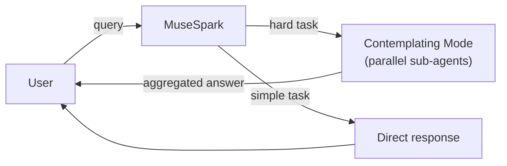

# Models — 2026-04-28

## Meta Muse Spark — Meta's first proprietary AI model 

**Source:** [Meta AI Blog](https://ai.meta.com/blog/introducing-muse-spark-msl/) · **Type:** release · **Time (UTC):** April 8, 2026 *(catch-up — not covered in prior digests)*

Meta Superintelligence Labs (MSL), led by Alexandr Wang, released Muse Spark on April 8 — the company's first closed-weights model and the debut of its new Muse family. Unlike the Llama series, Muse Spark is proprietary: weights are not public, and API access is currently limited to a private preview for select partners. The model is natively multimodal (text, vision, tool use, visual chain-of-thought) and introduces a "Contemplating mode" that orchestrates parallel sub-agents for hard reasoning tasks.

**Why it matters:** Muse Spark is a strategic pivot away from Meta's open-source identity. On the Humanity's Last Exam benchmark it scores 58 % in Contemplating mode and 38 % on FrontierScience Research, while Meta claims it achieves comparable capability to Llama 4 Maverick with over an order of magnitude less compute. It currently powers meta.ai and is rolling out to WhatsApp, Instagram, Facebook, and Messenger.

| Benchmark | Score (Contemplating) |
|---|---|
| Humanity's Last Exam | 58 % |
| FrontierScience Research | 38 % |

---
