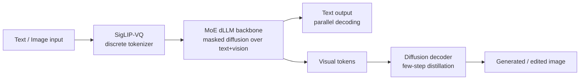

# Research — 2026-04-28

## LLaDA2.0-Uni: Unifying Multimodal Understanding and Generation 

**Source:** [arXiv 2604.20796](https://arxiv.org/abs/2604.20796) · **Type:** paper · **Time (UTC):** April 22, 2026

inclusionAI published LLaDA2.0-Uni, a unified discrete diffusion large language model (dLLM) that handles both multimodal understanding and image generation within a single architecture — no separate encoder-decoder split. The model combines a SigLIP-VQ semantic tokenizer (converting visual inputs into discrete tokens), a mixture-of-experts dLLM backbone that applies block-level masked diffusion over both text and image tokens jointly, and a diffusion decoder for high-fidelity image reconstruction. Multi-stage training on carefully curated data allows the backbone to perform parallel decoding while the decoder uses few-step distillation to reduce generation latency.

**Why it matters:** Autoregressive models have dominated unified VLM design, but LLaDA2.0-Uni demonstrates that discrete diffusion can match specialized vision-language models on understanding benchmarks while also generating and editing images — opening a path to architectures that treat text and vision tokens symmetrically without separate generation heads.

---

## Agentic World Modeling: Foundations, Capabilities, Laws, and Beyond 

**Source:** [Hugging Face Papers](https://huggingface.co/papers/) · [GitHub awesome list](https://github.com/matrix-agent/awesome-agentic-world-modeling) · **Type:** paper/survey · **Time (UTC):** April 24, 2026

A 42-researcher collaboration published a comprehensive survey that organises the fragmented literature on world models for AI agents into a two-axis taxonomy: three capability levels (reactive, deliberative, autonomous) and four law regimes (physical, social, logical, adversarial). The paper argues that current LLM agents lack the persistent, updatable environment representations that long-horizon planning requires, and proposes a research roadmap for integrating model-based and model-free planning under unified evaluation protocols.

**Why it matters:** As agent deployments grow beyond single-turn tool use into persistent, long-horizon tasks, the absence of a shared vocabulary for world model capabilities has made it hard to compare systems or identify failure modes. This taxonomy provides a concrete framework practitioners can use to diagnose gaps in their agent's environment representation.

---
