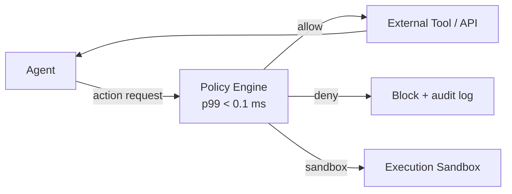

# Tools — 2026-04-28

## Microsoft Agent Governance Toolkit 

**Source:** [Microsoft Open Source Blog](https://opensource.microsoft.com/blog/2026/04/02/introducing-the-agent-governance-toolkit-open-source-runtime-security-for-ai-agents/) · **Type:** release · **Time (UTC):** April 2, 2026 *(catch-up — not covered in prior digests)*

Microsoft released the Agent Governance Toolkit, a seven-package open-source system (MIT license) that enforces runtime security policies for autonomous AI agents. The toolkit intercepts every agent action before execution and enforces allow/deny rules with sub-millisecond latency (p99 < 0.1 ms), covering all ten items in the OWASP Agentic AI Top 10. Packages are available in Python, TypeScript, Rust, Go, and .NET, with framework adapters for LangChain, CrewAI, Google ADK, and Microsoft Agent Framework. The project ships with 9,500+ tests and SLSA-compatible provenance; Microsoft intends to donate governance to an independent foundation.

**Why it matters:** There has been no standard mechanism for enforcing zero-trust security policies across multi-framework agent deployments; this toolkit is the first to address all OWASP agentic risks in a single, composable library. Organisations subject to the EU AI Act or SOC 2 audits now have an auditable runtime control layer they can drop into existing agent code.

---
