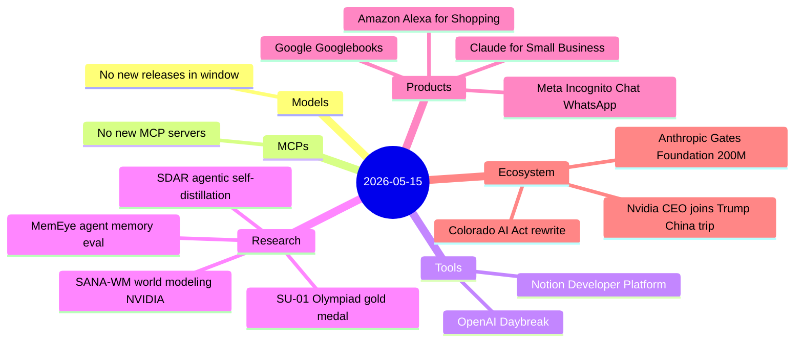
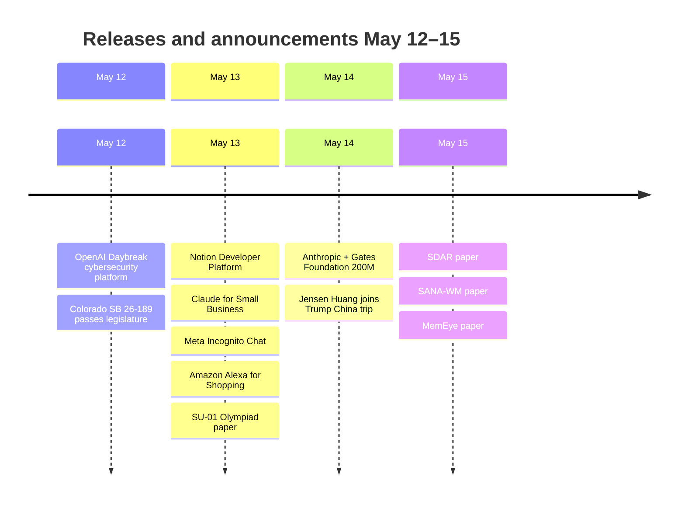

# AI Digest — 2026-05-15

> This digest covers May 12–15; the previous entry was April 28. The headline is Anthropic's $200 million, four-year partnership with the Gates Foundation (May 14) — the most concrete AI-for-global-development commitment from a frontier lab to date, targeting health, education, and agriculture across 4.6 billion underserved people. On the research side, SU-01 (a 30B-A3B MoE model) became the first published system to reach gold-medal-level performance on IMO 2025 and USAMO 2026 using a three-stage training recipe. The product story is dense: Anthropic also launched Claude for Small Business, Notion opened its workspace as an AI agent orchestration hub, Amazon retired Rufus in favor of an agentic Alexa for Shopping, and Meta deployed private AI chat via Trusted Execution Environments in WhatsApp. The week's underlying theme is AI expanding simultaneously in every direction: downmarket to SMBs, into autonomous cybersecurity tooling, and toward global development impact.

## Day at a glance

## Top stories

1. **Anthropic + Gates Foundation: $200M global AI deployment** — A four-year, $200M commitment of grants, Claude credits, and engineering support targeting health-ministry decision tools, K–12 tutoring in sub-Saharan Africa, and agricultural AI for smallholder farmers — the first frontier-lab partnership of this scale with explicit Global South scope. [→ details](ecosystem.md#anthropic-gates-200m)
2. **SU-01 achieves gold-medal Olympiad math** — A 30B-A3B MoE trained with a three-stage curriculum (SFT → verifiable RL → proof-level RL) matches gold-medal performance on IMO 2025 and USAMO 2026, reasoning in chains exceeding 100,000 tokens. [→ details](research.md#su-01-olympiad)
3. **Notion becomes an AI agent orchestration hub** — Workers (cloud code sandbox), Database Sync (live Salesforce/Postgres/API pull), and an External Agent API supporting Claude Code, Cursor, Codex, and Decagon make Notion a first-class agent host — free through August 2026. [→ details](tools.md#notion-developer-platform)

## By the numbers

| Category   | Items | Highlight                                  |
|------------|------:|--------------------------------------------|
| Models     |     0 | No new model releases in window            |
| MCPs       |     0 | No new MCP servers or spec updates         |
| Tools      |     2 | Notion Developer Platform; OpenAI Daybreak |
| Research   |     4 | SU-01 gold-medal Olympiad reasoning        |
| Products   |     4 | Claude for Small Business launch           |
| Ecosystem  |     3 | Anthropic + Gates Foundation $200M         |

## Timeline (UTC)

## Files
- [Models](models.md)
- [MCPs](mcps.md)
- [Tools](tools.md)
- [Research](research.md)
- [Products](products.md)
- [Ecosystem](ecosystem.md)
