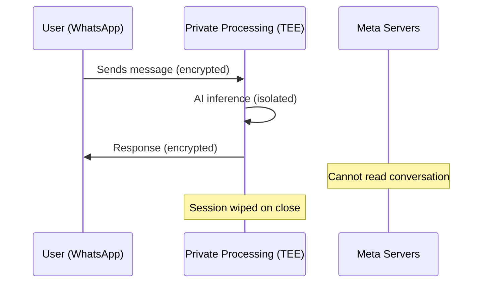

# Products — 2026-05-15

## Claude for Small Business 

**Source:** [TechCrunch](https://techcrunch.com/2026/05/13/anthropic-courts-a-new-kind-of-customer-small-business-owners/) · [SiliconANGLE](https://siliconangle.com/2026/05/13/anthropic-launches-claude-small-business-new-automation-workflows/) · **Type:** launch · **Time (UTC):** May 13

Anthropic launched **Claude for Small Business** as a toggle-install offering inside Claude Cowork, its workflow automation platform. It ships 15 prebuilt skills covering payroll planning, bookkeeping reconciliation, business-insights generation, marketing campaign creation, and employee onboarding. Integrations at launch: QuickBooks, PayPal, HubSpot, Canva, DocuSign, Google Workspace, and Microsoft 365. The design goal is "embed Claude inside tools businesses already use" rather than requiring custom AI builds. Anthropic is running a 10-city U.S. workshop tour starting May 14 in Chicago, offering free training sessions to 100 local business leaders per stop.

**Why it matters:** The 36 million U.S. small businesses are the single largest untapped enterprise segment for AI platforms. The toggle-install model — no dedicated AI team required — targets owners who won't hire ML engineers. This is Anthropic's most direct move into the horizontal SaaS market where Microsoft Copilot and Google Workspace AI have incumbent distribution advantages.

---

## Meta Incognito Chat for WhatsApp 

**Source:** [Meta Newsroom](https://about.fb.com/news/2026/05/incognito-chat-whatsapp-meta-ai/) · [TechCrunch](https://techcrunch.com/2026/05/13/whatsapp-adds-an-incognito-mode-in-meta-ai-chats/) · **Type:** launch · **Time (UTC):** May 13

Meta launched **Incognito Chat** for Meta AI on WhatsApp and the Meta AI app. Conversations run inside WhatsApp's Private Processing layer — a Trusted Execution Environment (TEE) that Meta claims it cannot access. Sessions are text-only, non-persistent (context is wiped on app close or screen lock), and not used for model training. The feature rolls out globally over coming months. A companion **Side Chat** mode for in-conversation AI assistance is planned for a later release.

**Why it matters:** Privacy-preserving AI inference via TEE is technically non-trivial at WhatsApp's scale (2B+ users). If the TEE architecture holds up to independent audit, it establishes a new baseline expectation for conversational AI privacy — particularly relevant as OpenAI faces litigation over stored chat logs. The limitation to text-only narrows utility but simplifies the privacy surface.

---

## Amazon Alexa for Shopping Replaces Rufus 

**Source:** [CNBC](https://www.cnbc.com/2026/05/13/amazon-ditches-rufus-ai-chatbot-in-favor-of-alexa-shopping-agent.html) · [TechCrunch](https://techcrunch.com/2026/05/13/amazon-launches-an-ai-shopping-assistant-for-the-search-bar-powered-by-alexa/) · **Type:** launch · **Time (UTC):** May 13

Amazon retired **Rufus** and replaced it with **Alexa for Shopping**, an Alexa+-powered assistant embedded directly in the Amazon search bar on mobile and desktop. Key capability upgrade: a **Buy for Me** feature that autonomously completes purchases on third-party retailer websites beyond Amazon's own marketplace. The assistant uses purchase history and browsing data for personalized recommendations, comparison tools, price tracking, and recurring-order scheduling. Available to all U.S. users without Prime membership or Echo hardware.

**Why it matters:** Rufus was a chatbot for product discovery. Alexa for Shopping is an agent that executes purchases — a structural shift from Q&A to autonomous commerce. The Buy for Me feature places Amazon's agent in competition with Google Shopping and Visa's Click to Pay for cross-web purchasing authority, with significant implications for affiliate and checkout-conversion economics.

---

## Google Googlebooks and Android Show Announcements 

**Source:** [TechCrunch](https://techcrunch.com/2026/05/12/everything-google-announced-at-its-android-show-from-googlebooks-to-vibe-coded-widgets/) · **Type:** announcement · **Time (UTC):** May 12

At Google's virtual Android Show: I/O Edition on May 12, Google announced **Googlebooks** — a new laptop line that replaces Chromebooks, manufactured with Acer, ASUS, Dell, HP, and Lenovo, arriving in stores fall 2026. Googlebooks ship with **Magic Pointer**, a Gemini-powered cursor that understands on-screen context and executes voice-directed actions on top of web pages and images. Additional announcements included improved Gemini Intelligence features and vibe-coded widget generation for Android.

**Why it matters:** Retiring the Chromebook brand and replacing it with an AI-first machine signals Google's intent to make Gemini a system-level capability rather than an application. Magic Pointer is the most concrete embodiment of "ambient AI" on the desktop — it reframes the cursor from a pointing device to a context-aware agent. Google I/O proper runs May 19–20 where Gemini model updates are expected.

---
