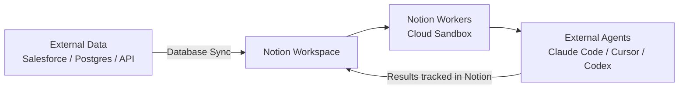

# Tools — 2026-05-15

## Notion Developer Platform 

**Source:** [TechCrunch](https://techcrunch.com/2026/05/13/notion-just-turned-its-workspace-into-a-hub-for-ai-agents/) · **Type:** launch · **Time (UTC):** May 13

Notion released a Developer Platform that turns its workspace into an AI agent orchestration layer. The core components are **Notion Workers** (a cloud sandbox where custom code runs, triggered by webhooks, with AI coding agents able to write the code), **Database Sync** (live data pull from Salesforce, Zendesk, Postgres, and any API-connected source), and an **External Agent API** that lets teams assign tasks to and track Claude Code, Cursor, Codex, and Decagon agents as if they were native Notion members. A new **Notion CLI** ships across all pricing tiers.

**Why it matters:** Notion has ~80 million users and is already embedded in many engineering workflows. Making it an agent host rather than just a document store means teams can route agentic work through existing knowledge bases without building custom orchestration infrastructure. Free access through August 2026 lowers the trial cost to zero.

---

## OpenAI Daybreak 

**Source:** [The Hacker News](https://thehackernews.com/2026/05/openai-launches-daybreak-for-ai-powered.html) · [OpenAI](https://openai.com/daybreak/) · **Type:** launch · **Time (UTC):** May 12

OpenAI launched **Daybreak**, a cybersecurity platform combining Codex Security with three GPT-5.5 model variants for automated vulnerability detection and patch generation. The system builds an editable threat model for a target repository, identifies and tests vulnerabilities in an isolated environment, and proposes fixes. Access is structured in tiers: standard GPT-5.5 for general use, GPT-5.5 with Trusted Access for Cyber (for verified defensive work), and GPT-5.5-Cyber (permissive, for red-teaming and penetration testing). Partners at launch include Akamai, Cisco, Cloudflare, CrowdStrike, Fortinet, Oracle, Palo Alto Networks, and Zscaler. Access remains tightly controlled — organizations can request vulnerability scans or contact OpenAI's sales team. No public pricing has been disclosed.

**Why it matters:** Daybreak is OpenAI's direct response to Anthropic's Claude Mythos security positioning. The three-tier model (standard/trusted/permissive) establishes a precedent for conditional access controls on frontier security-capable models, which regulators and security researchers have been asking for. The Cisco/CrowdStrike/Palo Alto partner list means this enters production security stacks immediately.

---
