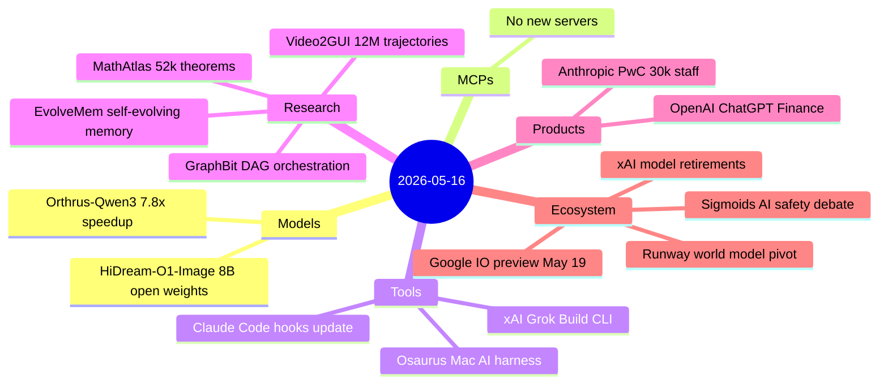
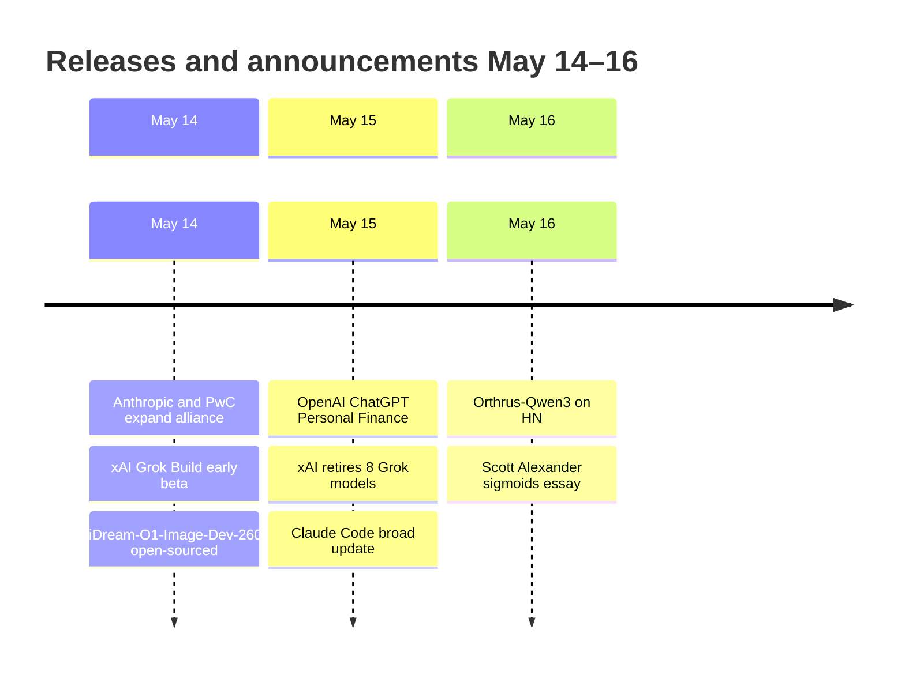

# AI Digest — 2026-05-16

> OpenAI's ChatGPT Personal Finance feature (live Plaid integration for 12,000+ institutions) and xAI's Grok Build terminal CLI are the headline product releases of the 24-hour window, with Anthropic's expanded PwC partnership (30,000 staff training, missed from yesterday's digest) completing the enterprise AI story. On the research front, MathAtlas introduces the first large-scale autoformalization benchmark of graduate mathematics (~52k theorems), while Orthrus demonstrates a lossless 7.8× inference speedup for Qwen3 via a dual-architecture framework. Google I/O looms three days out (May 19) with Gemini 4.0 and Aluminum OS widely expected, and Scott Alexander's "The sigmoids won't save you" essay drew 196 HN upvotes with a measured argument that capability curves have not historically plateaued when critics predicted they would.

## Day at a glance

## Top stories

1. **OpenAI ChatGPT Personal Finance** — Real-time bank account and investment data via Plaid (12,000+ institutions) lands in ChatGPT Pro for U.S. users; marks OpenAI's entry into fintech with read-only account access and GPT-5.5-class financial reasoning. [→ details](products.md#chatgpt-personal-finance)
2. **xAI Grok Build: agentic coding CLI enters early beta** — Grok Build runs up to 8 parallel subagents with a 2M-token context window on Grok 4.3 beta; access requires the new SuperGrok Heavy tier at $99/month introductory rate. [→ details](tools.md#grok-build)
3. **MathAtlas: first graduate-level math autoformalization benchmark** — ~52k theorems, definitions, and proofs from 103 graduate textbooks with ~178k dependency-graph edges, filling the gap between competition-math benchmarks and actual mathematical research. [→ details](research.md#mathatlas)

## By the numbers

| Category   | Items | Highlight                                        |
|------------|------:|--------------------------------------------------|
| Models     |     2 | Orthrus: 7.8× lossless Qwen3 speedup            |
| MCPs       |     0 | —                                                |
| Tools      |     3 | Grok Build agentic CLI; Claude Code hooks        |
| Research   |     4 | MathAtlas; GraphBit 0% framework hallucinations  |
| Products   |     2 | ChatGPT Personal Finance; Anthropic + PwC        |
| Ecosystem  |     4 | Google I/O May 19; Runway world model pivot      |

## Timeline (UTC)

## Files
- [Models](models.md)
- [MCPs](mcps.md)
- [Tools](tools.md)
- [Research](research.md)
- [Products](products.md)
- [Ecosystem](ecosystem.md)
