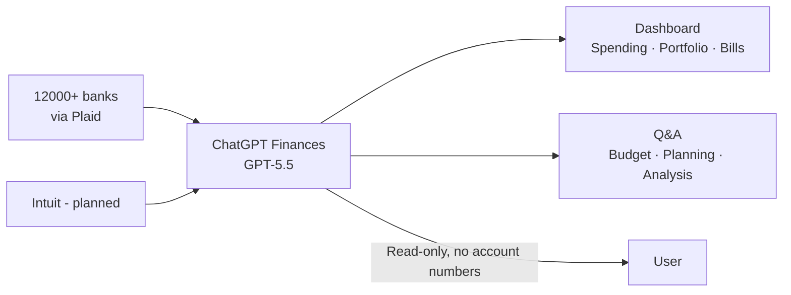

# Products — 2026-05-16

## OpenAI ChatGPT Personal Finance 

**Source:** [TechCrunch](https://techcrunch.com/2026/05/15/openai-launches-chatgpt-for-personal-finance-will-let-you-connect-bank-accounts/) · [OpenAI](https://openai.com/news/) · **Type:** launch · **Time (UTC):** May 15

OpenAI launched a personal finance feature for ChatGPT Pro subscribers in the U.S., in preview. Users connect bank accounts, credit cards, investment accounts, and other financial instruments via Plaid, which supports over 12,000 financial institutions — Schwab, Fidelity, Chase, Robinhood, American Express, and Capital One are among the launch integrations. ChatGPT displays a dashboard showing portfolio performance, spending breakdowns, subscriptions, and upcoming payments. The underlying model (GPT-5.5) handles multi-account aggregation and context-heavy financial reasoning. An Intuit integration (for tax impact analysis and credit approval estimates) is planned as a near-term addition. Access is via a "Finances" sidebar item or by typing `@Finances, connect my accounts` in any chat. Data can be removed via Settings → Apps → Finances; synced data is deleted within 30 days of disconnecting.

**Why it matters:** Mint shut down in 2023, and the personal finance aggregator space has been fragmented since. ChatGPT's read-only aggregation approach (no account numbers, no transaction execution) positions it as a conversational layer on top of Plaid — which already has the banking relationships. If OpenAI expands this to Plus subscribers and adds Intuit's tax data, it becomes the most capable free-tier personal finance tool available, with significant implications for Intuit's TurboTax and Credit Karma franchises.

---

## Anthropic Expands PwC Alliance: 30,000 Staff, Claude-Native Finance Group 

**Source:** [Anthropic](https://www.anthropic.com/news/pwc-expanded-partnership) · [PwC](https://www.pwc.com/us/en/about-us/newsroom/press-releases/anthropic-pwc-expand-alliance-agentic-enterprise.html) · [SiliconANGLE](https://siliconangle.com/2026/05/14/pwc-expands-anthropic-alliance-will-train-30000-staff-claude/) · **Type:** partnership · **Time (UTC):** May 14

Anthropic and PwC announced a major expansion of their strategic alliance. PwC will train and certify 30,000 professionals on Claude, deploy Claude Code and Claude Cowork starting with U.S. teams and then globally across its workforce of hundreds of thousands, and establish a joint Center of Excellence. PwC is launching a Claude-native finance business group combining PwC's domain expertise with the full Anthropic platform surface — Claude productivity integrations, Cowork, and Claude Code. The three focus areas are agentic technology build (custom enterprise deployments), AI-native deal-making (M&A and transactions), and enterprise function reinvention. Reported client outcomes include insurance underwriting cycle compression from 10 weeks to 10 days and cybersecurity incident response reduced from hours to minutes.

**Why it matters:** PwC serves most of the Fortune 500 and has deep relationships in finance, healthcare, and government — sectors where AI adoption has been slower due to compliance and trust requirements. Training 30,000 professionals on Claude Code and Cowork makes PwC the first major consulting firm to standardize on a single AI platform at scale, which will shape how its clients procure and think about AI tooling. The Claude-native finance group also positions Anthropic to compete in financial services against Microsoft Copilot and Salesforce Einstein, where incumbent integrations are strong.

---
