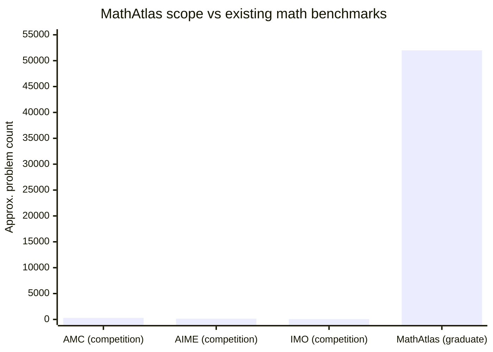

# Research — 2026-05-16

## MathAtlas: Large-Scale Graduate Mathematics Autoformalization Benchmark 

**Source:** [arXiv 2605.14061](https://arxiv.org/abs/2605.14061) · **Type:** paper · **Time (UTC):** May 15

MathAtlas is the first large-scale autoformalization benchmark of graduate-level mathematics, containing approximately 52,000 theorems, definitions, exercises, examples, and proofs extracted from 103 graduate mathematics textbooks. The dataset is enriched with a mathematical dependency graph containing approximately 178,000 relations, enabling evaluation of whether models can understand not just individual propositions but their interdependencies. Autoformalization — converting informal mathematical text into machine-verifiable formal proofs — has been a key bottleneck in applying AI to real mathematical research, as existing benchmarks (AMC, AIME, IMO) test competition mathematics rather than graduate-level material.

**Why it matters:** Competition-math benchmarks (including the IMO-level benchmarks recently cleared by SU-01, covered May 15) are increasingly saturated and do not represent the structure of research mathematics. MathAtlas creates an evaluation surface closer to what formal verification and AI-assisted theorem proving actually require, which is prerequisite to using LLMs in mathematical research pipelines.

---

## GraphBit: Engine-Orchestrated Agent Framework via DAGs 

**Source:** [arXiv 2605.13848](https://arxiv.org/abs/2605.13848) · **Type:** paper · **Time (UTC):** May 15

GraphBit proposes replacing LLM-prompted orchestration with engine-driven DAG (directed acyclic graph) execution for multi-agent systems. The system achieves 67.6% on the GAIA benchmark with zero framework-induced hallucinations — a category of error where the orchestrator LLM fabricates agent capabilities or task sequences. By moving orchestration logic into a deterministic graph engine rather than a free-form reasoning loop, GraphBit separates correctness-of-structure (engine's job) from correctness-of-content (agent's job). The DAG representation also enables compile-time validation of task dependencies.

**Why it matters:** Framework-induced hallucination is an underreported failure mode in production agentic systems — the orchestrator confidently assigns tasks to agents that cannot execute them. Moving orchestration from prompted reasoning to structured execution is architecturally similar to how compilers replaced hand-written assembly: the framework becomes verifiable. The 0% framework-induced hallucination rate at 67.6% GAIA accuracy is a useful baseline for comparing orchestration approaches.

---

## EvolveMem: Self-Evolving Memory Architecture for LLM Agents 

**Source:** [arXiv 2605.13941](https://arxiv.org/abs/2605.13941) · **Type:** paper · **Time (UTC):** May 15

EvolveMem introduces a memory system that autonomously conducts iterative research cycles on its own architecture — analyzing retrieval failures, generating hypotheses about better memory organization, running controlled experiments, and updating its own configuration. The system achieves a 25.7% relative improvement over static memory baselines by discovering task-specific memory structures (e.g., hierarchical indexing for long-session agent tasks vs. flat retrieval for single-turn lookups) without manual tuning.

**Why it matters:** Long-running agent memory is one of the main engineering problems preventing reliable multi-session AI assistants. Most current approaches use fixed retrieval strategies designed before deployment. EvolveMem's ability to self-reconfigure based on observed failure modes brings the memory layer closer to how software engineers tune database indices — iteratively, based on query patterns in production. The 25.7% relative improvement without any task-specific engineering is a strong signal.

---

## Video2GUI: 12M GUI Interaction Trajectories from Unlabeled Video 

**Source:** [arXiv 2605.14747](https://arxiv.org/abs/2605.14747) · **Type:** paper · **Time (UTC):** May 15

Video2GUI constructs WildGUI, a dataset of 12 million GUI interaction trajectories extracted from 500 million unlabeled internet videos, using automated pipeline that identifies UI screens, localizes clickable elements, and reconstructs action sequences. The resulting pretraining corpus improves agent performance across multiple GUI benchmarks when used for pretraining before task-specific fine-tuning.

**Why it matters:** The bottleneck for GUI agents (web automation, desktop control, mobile agents) has been labeled trajectory data — human demonstrations are expensive and narrow. Extracting 12M trajectories from publicly available video at scale removes that bottleneck. The approach generalizes the "internet video as pretraining data" paradigm from vision models to action models, with direct implications for tools like Claude Code's web browsing, OpenAI's Operator, and browser-control frameworks.

---
