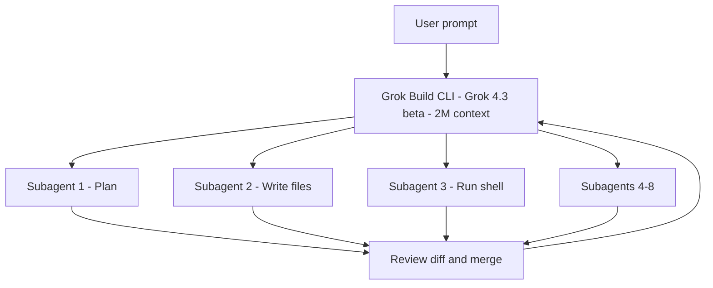

# Tools — 2026-05-16

## xAI Grok Build: Agentic Coding CLI Early Beta 

**Source:** [xAI News](https://x.ai/news) · [Engadget](https://www.engadget.com/2173482/xai-coding-agent-grok-build/) · [AndroidHeadlines](https://www.androidheadlines.com/2026/05/xai-grok-build-agentic-ai-coding-tool-launch-beta.html) · **Type:** launch · **Time (UTC):** May 14

xAI launched Grok Build, a terminal-native agentic CLI for coding and software automation. The tool runs on Grok 4.3 beta with a 2 million-token context window and can spawn up to 8 concurrent subagents that simultaneously plan, search documentation, write files, and execute shell commands. Key capabilities include worktree support (isolated git branches per task), parallel subagent orchestration, headless mode for CI/CD pipelines, ACP (Agent Communication Protocol) support, and clean diff presentation. The launch introduced a new SuperGrok Heavy subscription tier normally priced at $299/month, with a $99/month introductory rate for the first six months. Elon Musk solicited public beta testers on May 14 and the announcement attracted approximately 1.5 million views within minutes.

**Why it matters:** Grok Build enters a market where Claude Code, OpenAI Codex, Cursor, and Cline already compete. Its differentiation points are the 2M-token context window (the largest among coding CLIs at launch) and native 8-agent parallelism — twice the ceiling of most competitors. The SuperHeavy tier pricing establishes a distinct "power agent" price point well above typical Pro tiers.

---

## Claude Code: Hooks, Plugins, and MCP Improvements 

**Source:** [GitHub anthropics/claude-code releases](https://github.com/anthropics/claude-code/releases) · [Releasebot](https://releasebot.io/updates/anthropic/claude-code) · **Type:** update · **Time (UTC):** May 15–16

Anthropic shipped a broad Claude Code release with improvements across hooks, plugins, MCP handling, and UI polish. Key additions: (1) a `terminalSequence` field in hook JSON output enables hooks to emit desktop notifications, window titles, and terminal bells without a controlling TTY — useful for background agent tasks; (2) `CLAUDE_CODE_PLUGIN_PREFER_HTTPS` clones GitHub-hosted plugins over HTTPS instead of SSH, unblocking environments without GitHub SSH keys; (3) `ANTHROPIC_WORKSPACE_ID` supports workload identity federation by scoping minted tokens to a specific workspace when a federation rule covers multiple workspaces. A spinner now warms to amber after 10 seconds of model thinking to signal continued activity. A bug fix corrects background side-queries sending an unavailable Haiku model ID on Bedrock, Vertex, Foundry, and API gateway deployments — they now fall back to the main-loop model.

**Why it matters:** The `terminalSequence` hook and HTTPS-clone flag both address CI/CD deployment pain points for teams running Claude Code in restricted environments. The workspace-scoping addition is relevant for enterprise deployments using OIDC-based credentials across multiple Claude projects, where token scope leakage was a compliance concern.

---

## Osaurus: Local-and-Cloud AI Harness for Mac 

**Source:** [TechCrunch](https://techcrunch.com/2026/05/15/osaurus-brings-both-local-and-cloud-ai-models-to-your-mac/) · **Type:** launch · **Time (UTC):** May 15

Osaurus is an open-source Mac application that acts as a unified control layer for both local and cloud AI models. It supports local models including Llama, DeepSeek V4, and Qwen3, plus cloud providers (OpenAI and Anthropic). Over 20 native plugins integrate with Mail, Calendar, Browser, Git, and Vision. MCP server compatibility allows connecting externally hosted tools without custom integrations. All local inference runs inside a hardware-isolated virtual sandbox. Hardware requirements are at least 64 GB RAM for local models (128 GB recommended for DeepSeek V4). The project evolved from Dinoki, a desktop AI companion, after users raised per-token cost concerns. Currently at 112,000 downloads since launch.

**Why it matters:** Osaurus targets non-developer Mac users who want privacy-first local AI without Ollama's or LM Studio's CLI complexity. Its MCP compatibility means it inherits the growing server ecosystem without custom connectors. The 112K download figure indicates organic traction in a segment where most local AI tools still assume developer-level comfort with the terminal.

---
