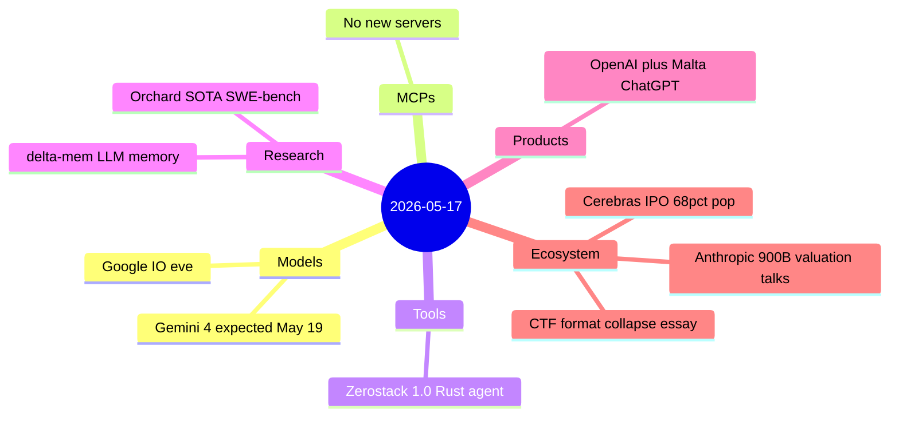
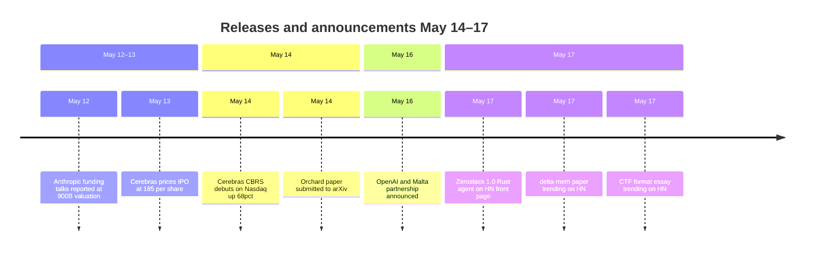

# AI Digest — 2026-05-17

> Today is the eve of Google I/O (keynote 19 May), and the news is correspondingly quiet — the industry is holding its breath. The headline items are two ecosystem stories that slipped through prior digests: Anthropic's active talks to raise $30B at a $900B+ valuation (Bloomberg, 12 May), and Cerebras Systems' blockbuster Nasdaq IPO that popped 68% on its 14 May debut. On the product side, OpenAI delivered the first nationally-scoped ChatGPT Plus deployment in Malta, gated on completion of a state-sponsored AI literacy course. Research highlights are Microsoft Research's Orchard framework — which sets a new open-source SWE-bench Verified record at 67.5% — and δ-mem, a compact 8×8 associative-memory bolt-on that improves any frozen LLM's memory tasks without retraining. A widely-read essay on Hacker News argues that frontier AI has permanently broken the open CTF format, a signal with broader implications for how the industry evaluates human technical skill.

## Day at a glance

## Top stories

1. **Anthropic in talks for $30B round at $900B+ valuation** — Bloomberg (12 May) and NYT (up to $950B) both report active negotiations led by Dragoneer, Greenoaks, Sequoia, and Altimeter; Anthropic's ARR has reportedly exceeded $44B. If completed at $950B, this would make Anthropic briefly the highest-valued private AI company. [→ details](ecosystem.md#anthropic-funding-900b)
2. **OpenAI deploys ChatGPT Plus nationally in Malta** — The first sovereign-government deal to make ChatGPT Plus a state-provided utility, gated on completing a free University of Malta AI literacy course; managed by the Malta Digital Innovation Authority. [→ details](products.md#openai-malta)
3. **Orchard: Microsoft Research open-source agentic framework hits 67.5% SWE-bench** — A unified training/eval harness covering coding, GUI, and personal-assistant agents, with a shared sandbox environment; Orchard-SWE sets new open-source state of the art. [→ details](research.md#orchard)

## By the numbers

| Category   | Items | Highlight                                         |
|------------|------:|---------------------------------------------------|
| Models     |     0 | Google I/O eve; Gemini 4 expected 19 May          |
| MCPs       |     0 | —                                                 |
| Tools      |     1 | Zerostack 1.0: 8.9 MB Rust coding agent           |
| Research   |     2 | Orchard: 67.5% SWE-bench Verified (open SOTA)     |
| Products   |     1 | OpenAI + Malta: first national ChatGPT+ deployment|
| Ecosystem  |     3 | Anthropic $900B+ round; Cerebras 68% IPO pop      |

## Timeline (UTC)

## Files
- [Models](models.md)
- [MCPs](mcps.md)
- [Tools](tools.md)
- [Research](research.md)
- [Products](products.md)
- [Ecosystem](ecosystem.md)
