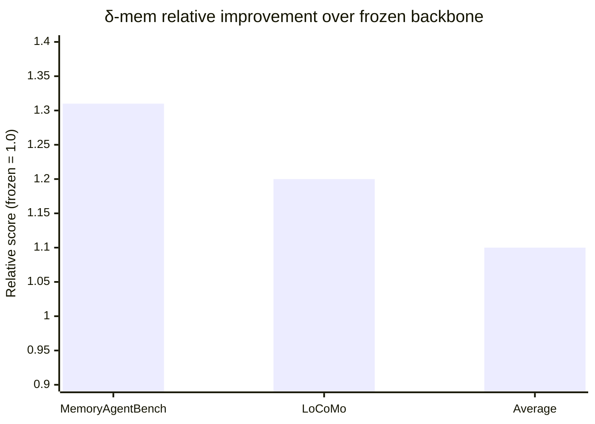
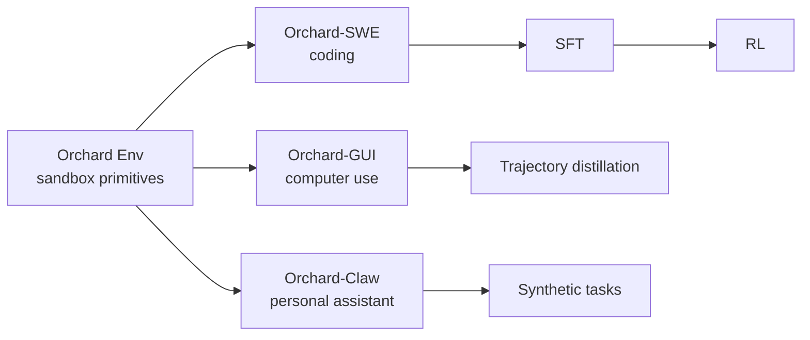

# Research — 2026-05-17

## δ-mem: Efficient Online Memory for Large Language Models 

**Source:** [arXiv 2605.12357](https://arxiv.org/abs/2605.12357) · [GitHub](https://github.com/declare-lab/delta-Mem) · **Type:** paper · **Time (UTC):** submitted 12 May (HN front page today, 210 pts)

Researchers from SUTD/declare-lab introduce δ-mem, a lightweight memory mechanism that augments a *frozen* full-attention LLM with a compact online associative-memory state. The state — just an 8×8 matrix — is updated via delta-rule learning on incoming tokens and its readout injects low-rank corrections into the backbone's attention computation at inference. No fine-tuning of the backbone is required. On memory-heavy benchmarks the frozen backbone improves 1.31× on MemoryAgentBench and 1.20× on LoCoMo, with an average 1.10× gain versus non-δ-mem baselines and 1.15× versus the strongest prior memory baseline.

**Why it matters:** δ-mem demonstrates that meaningful persistent memory can be bolted onto any frozen LLM through a ~64-parameter state matrix, without re-training or extending the context window. This is a practical target for production deployments where retraining is off the table.

---

## Orchard: Open-Source Agentic Modeling Framework 

**Source:** [arXiv 2605.15040](https://arxiv.org/abs/2605.15040) · **Type:** paper + framework · **Time (UTC):** submitted 14 May

Microsoft Research (Baolin Peng et al., 14 authors) releases Orchard, an open-source framework for training and evaluating agentic models across three task domains. Core abstraction is **Orchard Env** — a lightweight environment service that provides reusable sandbox lifecycle primitives shared across domains and pipeline stages (SFT, RL, evaluation). Three specialised recipes ship with the framework:

| Recipe | Domain | Key result |
|---|---|---|
| Orchard-SWE | Coding agents | 64.3% SWE-bench Verified (SFT); **67.5%** (SFT + RL) — new open-source SOTA |
| Orchard-GUI | Vision-language computer use (4B model) | 74.1% WebVoyager / 67.0% Online-Mind2Web / 64.0% DeepShop |
| Orchard-Claw | Personal assistant agents | 59.6% pass@3 Claw-Eval (0.2K synthetic tasks only) |

The 67.5% SWE-bench Verified figure from a single open framework, achieved via RL on top of SFT, is the headline result for the coding-agent community.

**Why it matters:** Orchard lowers the barrier to reproducing and extending state-of-the-art agentic training. The shared Orchard Env means a single infra investment covers GUI agents, coding agents, and personal assistants — compared with the usual per-domain one-off harnesses.

---
