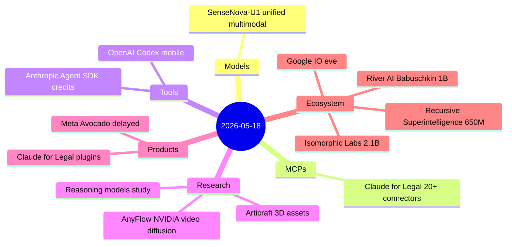
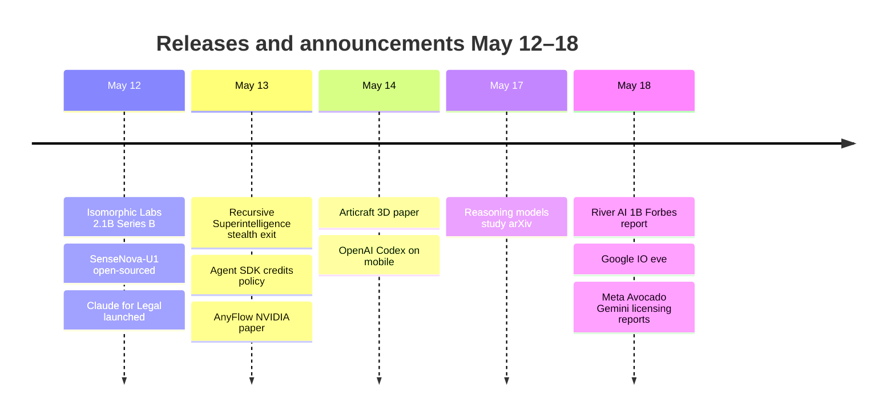

# AI Digest — 2026-05-18

> Google I/O 2026 opens tomorrow (May 19) with Gemini 4.0 and Android XR glasses widely expected, making today the eve of the industry's largest annual developer conference. Three major funding events dominate the broader news: Recursive Superintelligence emerged from four months of stealth with $650M at a $4.65B valuation; Isomorphic Labs (the DeepMind-spun-out AlphaFold company) closed a $2.1B Series B led by Thrive Capital; and xAI co-founder Igor Babuschkin is in Forbes-reported talks to raise $1B for a new lab called River AI. Today's digest also catches up on the May 12 Claude for Legal launch — 20+ MCP connectors and 12 practice-area plugins missed in the May 15 digest — along with NVIDIA's AnyFlow video diffusion framework and SenseTime's open-source SenseNova-U1 unified multimodal model.

## Day at a glance

## Top stories

1. **Recursive Superintelligence exits stealth at $4.65B** — Richard Socher, Yuandong Tian (ex-Meta FAIR), and Alexey Dosovitskiy (ViT co-author) launched after four months with $650M from GV, Greycroft, NVIDIA, and AMD; first product targets autonomous AI research automation. [→ details](ecosystem.md#recursive-superintelligence)
2. **Anthropic Claude for Legal: 20+ connectors, 12 practice-area plugins** — Integrates Claude into Ironclad, Relativity, Thomson Reuters CoCounsel, Harvey, iManage, and more; live on matters at Freshfields, Quinn Emanuel, and Holland & Knight. [→ details](products.md#claude-for-legal)
3. **Isomorphic Labs closes $2.1B Series B** — The DeepMind spinout behind AlphaFold will use the capital to scale its IsoDDE drug design engine toward clinical development; backed by Thrive Capital, Alphabet, and the UK Sovereign AI Fund. [→ details](ecosystem.md#isomorphic-labs)

## By the numbers

| Category   | Items | Highlight                                          |
|------------|------:|----------------------------------------------------|
| Models     |     1 | SenseNova-U1: VAE-free unified understanding+gen   |
| MCPs       |     1 | 20+ legal MCP connectors from Anthropic            |
| Tools      |     2 | Agent SDK credits; Codex on mobile                 |
| Research   |     3 | AnyFlow: any-step video diffusion, open weights    |
| Products   |     2 | Claude for Legal; Meta Avocado delay               |
| Ecosystem  |     4 | Recursive $650M; Isomorphic $2.1B; River AI $1B   |

## Timeline (UTC)

## Files
- [Models](models.md)
- [MCPs](mcps.md)
- [Tools](tools.md)
- [Research](research.md)
- [Products](products.md)
- [Ecosystem](ecosystem.md)
