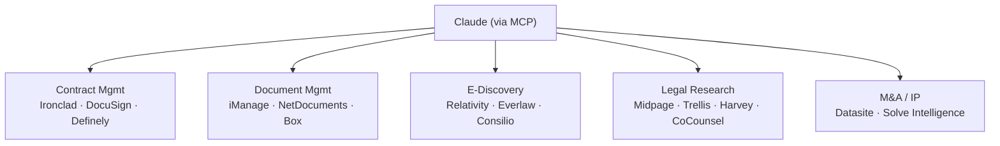

# MCPs — 2026-05-18

## Claude for Legal: 20+ MCP Connectors for the Legal Stack 

**Source:** [LawSites / LawNext](https://www.lawnext.com/2026/05/anthropic-goes-all-in-on-legal-releasing-more-than-20-connectors-and-12-practice-area-plugins-for-claude.html) · [Anthropic](https://www.anthropic.com/news) · **Type:** release · **Time (UTC):** May 12

Anthropic released more than 20 MCP connectors linking Claude to the software legal teams actually run on. Coverage spans contract management (Ironclad, DocuSign, Definely), document management (iManage, NetDocuments, Box), e-discovery (Relativity, Everlaw, Consilio), research (Midpage, Trellis, Legal Data Hunter, Harvey), M&A data rooms (Datasite), patent prosecution (Solve Intelligence), and — notably — Thomson Reuters' flagship CoCounsel Legal, which Thomson Reuters has rebuilt on Anthropic's technology. The connectors let Claude query live documents, pull case research, and surface deal-room materials within a single conversation.

**Why it matters:** Legal tooling has historically been a patchwork of standalone SaaS products with no common integration layer. Shipping a coherent MCP connector set for the major incumbent platforms means engineers and IT teams at law firms can wire Claude into existing workflows without custom API work. Thomson Reuters choosing to rebuild CoCounsel on Anthropic rather than compete is a strong signal that legal-tech incumbents are treating Claude as infrastructure.

See also: [Claude for Legal product launch](products.md#claude-for-legal)

---
