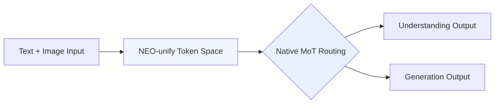

# Models — 2026-05-18

## SenseNova-U1: Unified Multimodal Understanding and Generation 

**Source:** [SenseTime](https://www.sensetime.com/en/news-detail/51170629) · [arXiv 2605.12500](https://arxiv.org/abs/2605.12500) · **Type:** release · **Time (UTC):** May 12

SenseTime open-sourced SenseNova-U1, a multimodal model family built on the self-developed NEO-unify architecture that handles image understanding, reasoning, and generation within a single model — eliminating both the visual encoder (VE) and variational autoencoder (VAE) used by prior unified designs. The core mechanism is "native Mixture of Tokens" (MoTs), which allows the model to process images and text in a shared token space rather than routing through separate encoder and decoder stacks. Two variants were released: SenseNova-U1-8B-MoT (dense) and SenseNova-U1-A3B-MoT (30B-A3B sparse MoE).

**Why it matters:** Eliminating the VAE removes a longstanding quality and training-stability bottleneck in unified multimodal models. The architecture is a structural departure from the encoder-decoder pipelines that dominated prior work (LLaVA, EMU, Gemini); if the approach generalises, it could reduce the complexity of building image-generating reasoning systems by roughly half.

---
