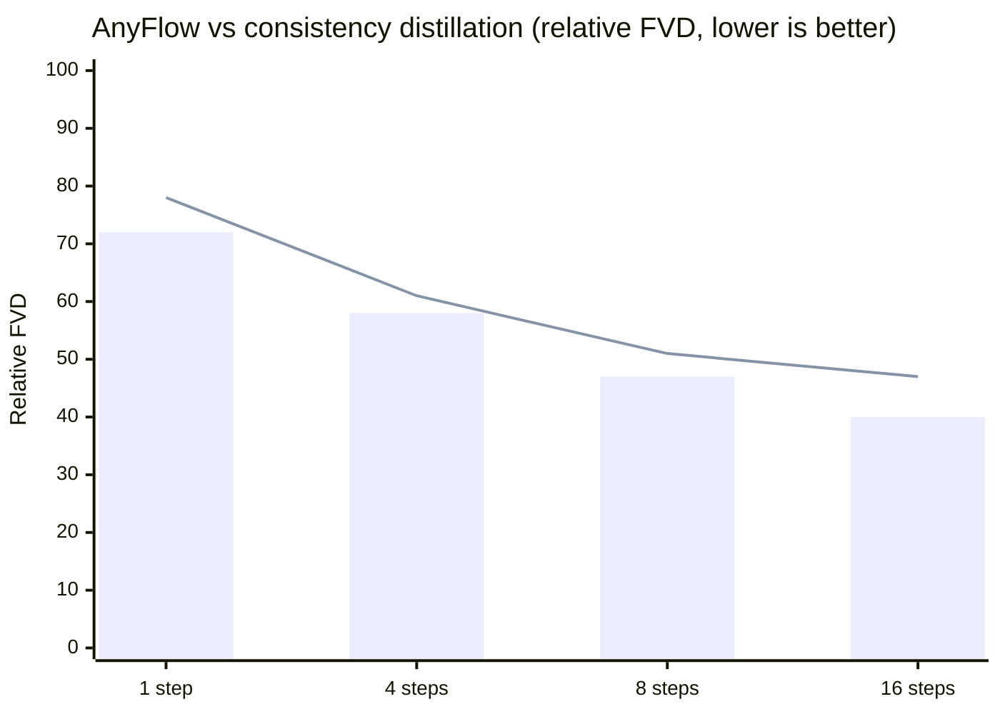

# Research — 2026-05-18

## AnyFlow: Any-Step Video Diffusion via Flow Map Distillation 

**Source:** [arXiv 2605.13724](https://arxiv.org/abs/2605.13724) · [NVlabs/AnyFlow](https://github.com/NVlabs/AnyFlow) · **Type:** paper + open weights · **Time (UTC):** May 13

NVIDIA Research introduced AnyFlow, a distillation framework for video diffusion models that breaks the fixed-step constraint of standard consistency distillation. Rather than learning a mapping from noise to clean output at a specific step count, AnyFlow optimises full ODE trajectories by shifting the learning objective to "flow-map transitions" over arbitrary time intervals. A new technique called Flow Map Backward Simulation decomposes a full Euler rollout into shortcut sub-steps, enabling on-policy distillation that generalises across budgets of 1–N steps. Experiments cover both bidirectional and causal architectures at 1.3B–14B parameter scales; AnyFlow matches or beats consistency-distilled models in the few-step regime while retaining quality-with-steps scaling.

**Why it matters:** Video diffusion distillation has been locked to fixed step counts (typically 4 or 8), forcing teams to choose between speed and quality at training time. AnyFlow makes the trade-off a runtime decision, which is practically significant for products that need low-latency previews and high-quality final renders from the same model.

*(Illustrative shape based on paper; exact values in paper Table 2)*

---

## Articraft: Agentic LLM System for Scalable Articulated 3D Assets 

**Source:** [arXiv 2605.15187](https://arxiv.org/abs/2605.15187) · [articraft3d.github.io](https://articraft3d.github.io/) · **Type:** paper + dataset · **Time (UTC):** May 14

Researchers from the University of Cambridge and University of Oxford presented Articraft, a system that uses an LLM agent to generate simulation-ready articulated 3D models at scale. The agent writes programs that construct assets through a restricted harness; the harness validates geometry and joint constraints and returns structured feedback when validation fails, iterating until the asset passes. This produces higher-quality outputs than direct generation or general-purpose coding agents. The team also released Articraft-10K, a curated dataset of over 10,000 articulated 3D models spanning 245 object categories, useful for robotics simulation and VR.

**Why it matters:** Articulated 3D assets (objects with moving joints — chairs, doors, robots) are a persistent bottleneck in robotics training pipelines; manual creation is slow and existing generators struggle with joint validity constraints. A 10K curated dataset at this scale and category breadth is a meaningful contribution for teams training manipulation policies.

---

## Reasoning Models Don't Just Think Longer — They Move Differently 

**Source:** [arXiv 2605.15454](https://arxiv.org/abs/2605.15454) · **Type:** paper · **Time (UTC):** May 17

Anders Gjølbye, Lars Kai Hansen (DTU), and Sanmi Koyejo (Stanford) investigated whether reasoning-optimised models differ from standard LLMs merely in compute time or in something more fundamental. They find reasoning models exhibit structurally distinct activation trajectories — not simply "longer paths" through the same geometry — suggesting that chain-of-thought training alters the underlying processing topology rather than just adding more steps to an unchanged forward pass.

**Why it matters:** If reasoning models represent a qualitatively different internal computation rather than a longer one, interpretability and steering techniques developed for standard LLMs may not transfer cleanly. This has implications for teams applying activation engineering or mechanistic interpretability to reasoning-class models.

---
