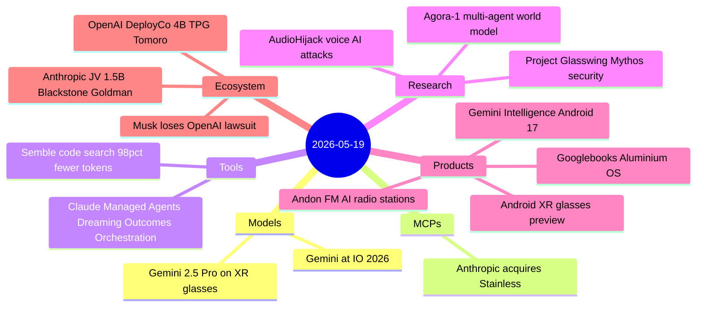
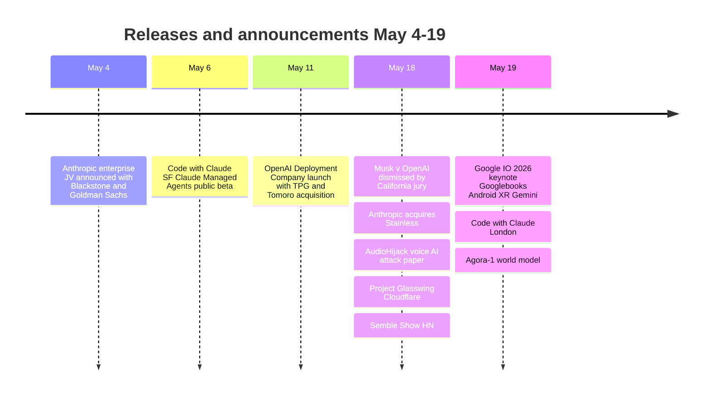

# AI Digest — 2026-05-19

> Google I/O 2026 opens today with Gemini Intelligence, Googlebooks (Android laptops running Aluminium OS), and Android XR smart glasses as the centrepiece announcements — Google's largest platform push in years. In the past 24 hours Anthropic acquired Stainless (~$300M), the SDK and MCP server tooling company whose generators power every official Anthropic SDK, collapsing a key piece of agentic infrastructure in-house. A California jury also unanimously dismissed all of Elon Musk's claims against OpenAI and Sam Altman on statute-of-limitations grounds. Two significant enterprise moves missed in prior digests surface today: Anthropic's $1.5B JV with Blackstone, Goldman Sachs, and H&F (May 4), and the OpenAI Deployment Company backed by $4B from TPG with the Tomoro consulting acquisition (May 11).

## Day at a glance

## Top stories

1. **Google I/O 2026: Googlebooks, Android XR glasses, Gemini Intelligence** — Google previews a premium Android laptop category running Aluminium OS and the first developer-ready smart glasses with Gemini 2.5 Pro, backed by Warby Parker, Gentle Monster, and Gucci. [→ details](products.md#googlebooks)
2. **Musk v. OpenAI dismissed on all counts** — A California jury unanimously ruled Musk's conversion-from-nonprofit claims were filed too late; Judge Gonzalez Rogers said she "was prepared to dismiss on the spot"; Musk plans a Ninth Circuit appeal. [→ details](ecosystem.md#musk-openai-lawsuit)
3. **Anthropic acquires Stainless (~$300M)** — The SDK and MCP tooling company that generated every official Anthropic SDK moves in-house; hosted generator product will be shut down but existing customer SDKs are retained. [→ details](mcps.md#stainless-acquisition)

## By the numbers

| Category   | Items | Highlight                                                  |
|------------|------:|------------------------------------------------------------|
| Models     |     1 | Gemini 2.5 Pro confirmed for Android XR; new Gemini at I/O |
| MCPs       |     1 | Stainless (~$300M): all official Anthropic SDK tooling     |
| Tools      |     2 | Semble: 98% token reduction vs grep; Managed Agents beta   |
| Research   |     3 | Mythos chains exploits at senior researcher level          |
| Products   |     4 | Googlebooks + Android XR; Gemini Intelligence; Andon FM    |
| Ecosystem  |     3 | Musk suit dismissed; Anthropic JV $1.5B; OAI DeployCo $4B |

## Timeline (UTC)

## Files
- [Models](models.md)
- [MCPs](mcps.md)
- [Tools](tools.md)
- [Research](research.md)
- [Products](products.md)
- [Ecosystem](ecosystem.md)
