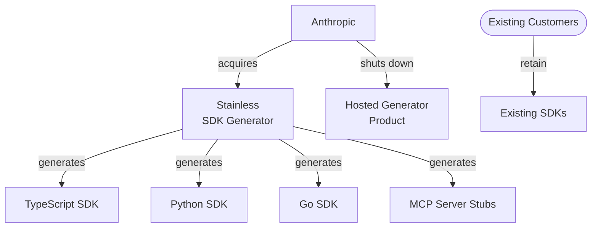

# MCPs — 2026-05-19

## Anthropic Acquires Stainless 

**Source:** [Anthropic](https://www.anthropic.com/news/anthropic-acquires-stainless) · [TechCrunch](https://techcrunch.com/2026/05/18/anthropic-has-acquired-the-dev-tools-startup-used-by-openai-google-and-cloudflare/) · **Type:** acquisition · **Time (UTC):** May 18, ~20:00

Anthropic announced the acquisition of Stainless, a 2022-founded company that generates SDKs (TypeScript, Python, Go, Java, Kotlin) and MCP server tooling from API specifications. Stainless has generated every official Anthropic SDK since the API launched; its platform was also used by OpenAI, Google, and Cloudflare to maintain their own client libraries. Terms were not disclosed, though reports indicate the deal valued Stainless at more than $300 million. As part of the transaction, Anthropic will wind down the hosted Stainless SDK-generator product, though existing customers retain full rights to any SDKs they have already generated. Founder Alex Rattray and the team join Anthropic's Platform Engineering organization.

**Why it matters:** MCP hit 97 million monthly SDK downloads and 10,000+ public servers by March 2026; bringing the primary toolchain for generating MCP server stubs and multi-language SDKs in-house gives Anthropic direct control over how agents connect to external APIs — a chokepoint in the agentic ecosystem. The move also eliminates a potential single point of dependency for multiple competing labs.

---
