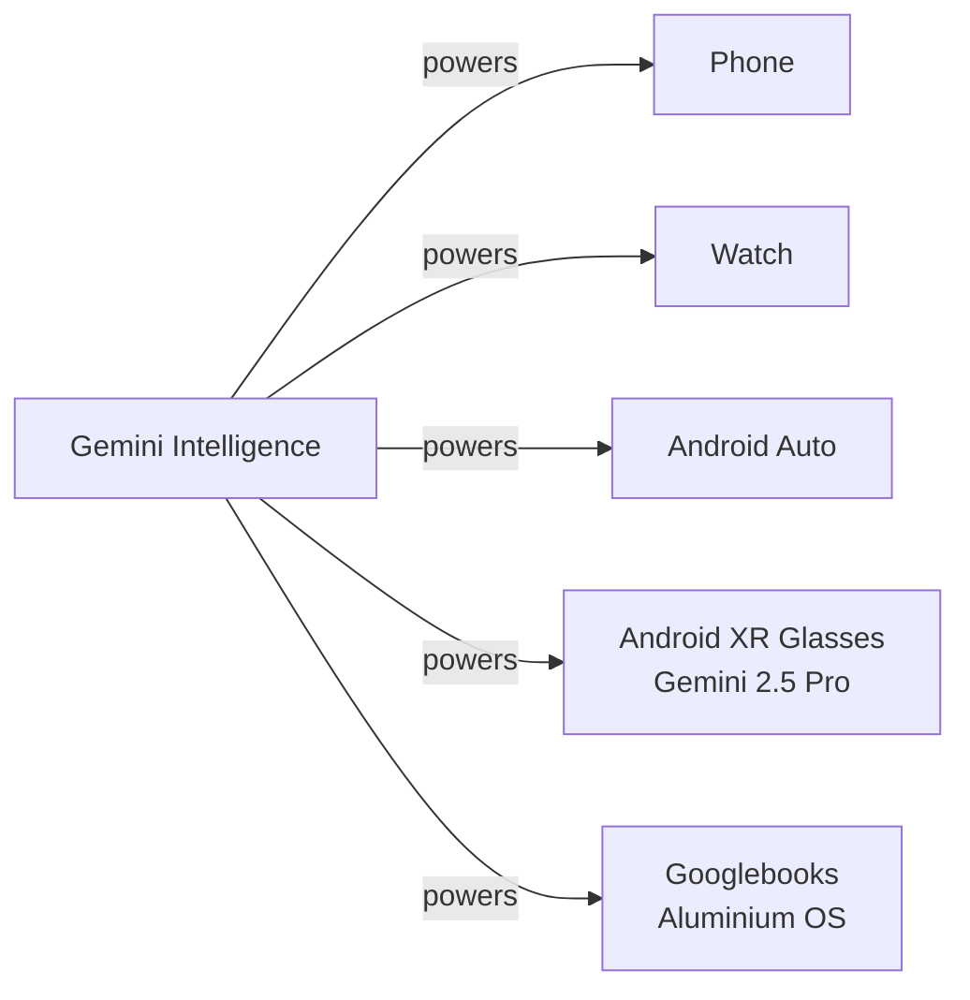

# Models — 2026-05-19

## Gemini at Google I/O 2026 

**Source:** [The Next Web](https://thenextweb.com/news/google-io-2026-gemini-intelligence-android-xr-glasses) · **Type:** release · **Time (UTC):** 17:00

Google's I/O 2026 keynote opened at 10 a.m. PT on May 19 with Gemini as the centrepiece. Pre-keynote confirmations from the Android Show include Gemini 2.5 Pro powering the new Android XR smart glasses, and Gemini 3.1 underpinning the new Gemini for Chrome on Android feature. Pre-event analyst positioning by TechTimes and others describes the new Gemini model landing roughly at the capability tier of OpenAI's GPT-5.5, behind Anthropic's Mythos in frontier benchmarks. Google is framing the release less around a version number bump and more around "Gemini Intelligence" — a proactive, background AI mode that completes multi-step tasks across phone, watch, car, and glasses without waiting for a prompt.

**Why it matters:** Gemini 2.5 Pro entering a consumer hardware form factor (glasses) at I/O and a new Gemini model at approximately GPT-5.5 tier narrows the capability gap Google was closing since Gemini 3.x; the "Gemini Intelligence" framing marks a deliberate shift from reactive chatbot to ambient agent, with concrete deployment timelines (Samsung Galaxy and Pixel, summer 2026).

| Confirmed model | Use case | Notes |
|----------------|----------|-------|
| Gemini 2.5 Pro | Android XR glasses | Real-time translation, navigation, visual understanding |
| Gemini 3.1 | Chrome on Android | Research, summarization, auto-browsing; AI Pro/Ultra subscribers |
| New Gemini (keynote) | Flagship tier | Analyst positioning: ~GPT-5.5; below Anthropic Mythos |

---
