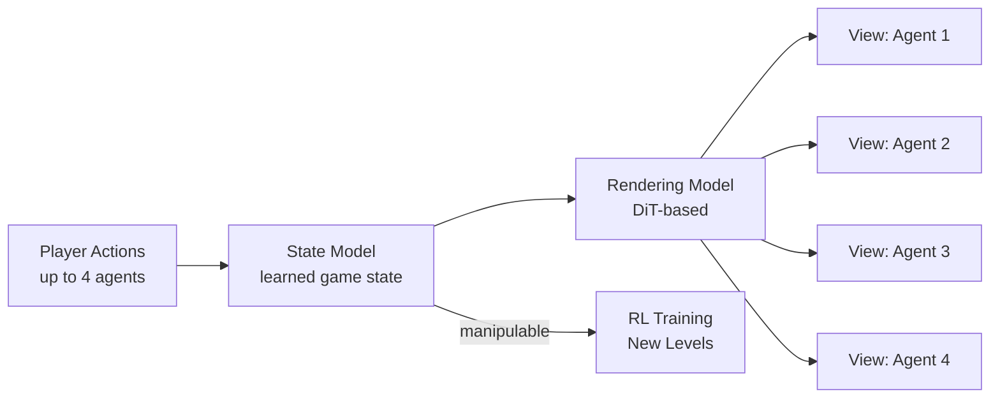

# Research — 2026-05-19

## Project Glasswing: Cloudflare Tests Mythos Preview on Its Own Infrastructure 

**Source:** [Cloudflare Blog](https://blog.cloudflare.com/cyber-frontier-models/) · **Type:** release · **Time (UTC):** May 18 (HN front page, 325 pts)

Cloudflare published a detailed account of participating in Anthropic's Project Glasswing — a controlled research programme providing early access to Mythos Preview (Anthropic's frontier model announced April 7) to trusted security partners for offensive testing against their own systems. Cloudflare's red team found that the model can chain several small attack primitives into working exploit chains at a level comparable to a senior security researcher, and can write, compile, and iteratively test proof-of-concept code to validate findings. The post also flags that Mythos Preview exhibits inconsistent refusal behaviour: identical tasks produce different outcomes depending on framing, making guardrails unreliable as standalone safety mechanisms.

**Why it matters:** This is the first public attestation from a major infrastructure company that a frontier model operates at senior-researcher level for vulnerability discovery; it confirms that the dual-use gap between defensive and offensive capability is narrowing faster than standard responsible-disclosure timelines assume.

---

## Agora-1: Multi-Agent World Model for Shared Virtual Environments 

**Source:** [Odyssey ML](https://odyssey.ml/introducing-agora-1) · **Type:** release · **Time (UTC):** May 19 (HN front page, 106 pts)

Odyssey ML released Agora-1, a generative simulation system that supports up to four simultaneous participants — human or AI — interacting in the same virtual environment, demonstrated with a GoldenEye deathmatch scenario. The architecture decouples a learned state model (trained on internal game state) from a DiT-based rendering model that generates consistent first-person views for each participant from the shared state. This separation avoids the context-scaling problems seen in earlier single-model world simulations (Multiverse, Solaris) and maintains world consistency when participants lose line of sight. A public demo is available at agora.odyssey.ml.

**Why it matters:** Separating world state from rendering is a key architectural advance for scalable multi-agent simulation; the approach is directly applicable to reinforcement learning training environments, robotics sim-to-real transfer, and multi-agent evaluation harnesses.

---

## AudioHijack: Imperceptible Audio Attacks Against Voice AI Systems 

**Source:** [IEEE Spectrum](https://spectrum.ieee.org/voice-ai-audio-attacks) · **Type:** paper · **Time (UTC):** May 18 (HN front page, 119 pts)

Researchers introduced AudioHijack, an attack technique that embeds imperceptible malicious instructions into audio waveforms using an optimization loop: generate a candidate audio perturbation, measure model response, refine until compliance. The attack achieves 79–96% success rates against 13 open-source models and commercial voice services from Microsoft and Mistral. Attack preparation takes approximately 30 minutes and the resulting adversarial audio can be reused. Demonstrated attack classes include false denials, refusal bypass, misinformation injection, malicious link delivery, persona alteration, and unauthorized tool use. Standard defences (prompt injection warnings) reduced success by only 7%.

**Why it matters:** Any production voice AI pipeline — transcription services, audio-triggered tool use, phone-based agents — is now a target for inaudible instruction injection; the 30-minute prep time and 7% defensive efficacy indicate this is a practical near-term threat, not a theoretical one.

---
