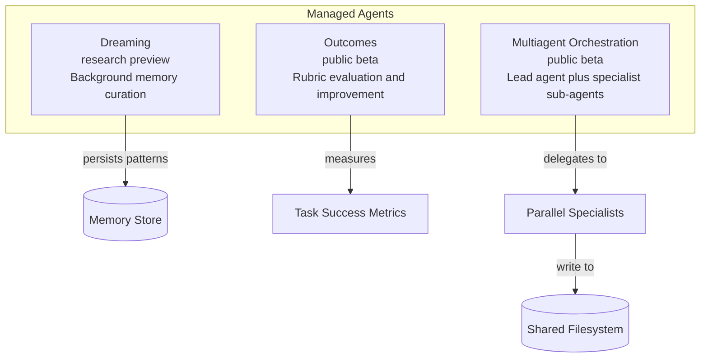

# Tools — 2026-05-19

## Semble: Token-Efficient Code Search for Agents 

**Source:** [GitHub — MinishLab/semble](https://github.com/MinishLab/semble) · **Type:** release · **Time (UTC):** May 18 (HN front page, 433 pts)

Semble is an open-source code search library designed specifically for AI agents. It uses tree-sitter to chunk files into semantically meaningful units, then combines Model2Vec static embeddings (semantic match) with BM25 (lexical match), fusing results with code-specific ranking signals — definition boosts, identifier stem matching, and noise penalties on test files. Because the embedding model requires no transformer forward pass at query time, the whole pipeline runs in milliseconds on CPU with no external API calls. The project benchmarks at 94% recall at 2,000 tokens compared to grep-then-read workflows that require ~100k tokens for 85% recall, a claimed 98% token reduction.

**Why it matters:** Token overhead from code context is a primary cost and latency bottleneck for coding agents; a local, zero-key retrieval layer that outperforms grep on both cost and recall is a practical drop-in for any agent codebase tool.

| Metric | Semble | Grep+Read |
|--------|--------|-----------|
| Recall @ 2k tokens | 94% | ~45% |
| Tokens for 85% recall | ~2,000 | ~100,000 |
| Runtime | ms (CPU) | ms (CPU) |
| External API | None | None |

---

## Claude Managed Agents: Dreaming, Outcomes, Multiagent Orchestration 

**Source:** [Code with Claude London](https://claude.com/code-with-claude/london) · [Code with Claude SF recap](https://blakecrosley.com/blog/code-with-claude-sf-2026-recap) · **Type:** release · **Time (UTC):** May 6 (SF launch); May 19 (London showcase)

Announced at Code with Claude SF (May 6) and showcased at the London event today, Anthropic launched three Claude Managed Agent capabilities into preview or public beta. **Dreaming** (research preview) is a scheduled background process that reviews agent sessions and memory stores, extracts patterns, and curates persistent memories across runs. **Outcomes** (public beta) is a rubric-based evaluation layer that lets developers define success criteria so agents can measure and improve their own task completion; Anthropic reported +8.4% task success on DOCX and +10.1% on PPTX files in internal benchmarks. **Multiagent Orchestration** (public beta) enables a lead agent to delegate to specialist sub-agents working in parallel on a shared filesystem, with webhook notifications on completion. The SF event also confirmed a SpaceX Colossus 1 compute partnership delivering 300+ megawatts (220,000+ NVIDIA GPUs) of additional capacity, and doubled five-hour rate limits across all paid tiers.

**Why it matters:** Dreaming and Outcomes move Claude from stateless tool invocations toward persistent, self-improving agents — a capability gap that has held back long-horizon production deployments; Multiagent Orchestration provides the parallel execution primitive that most enterprise workflows require.

---
