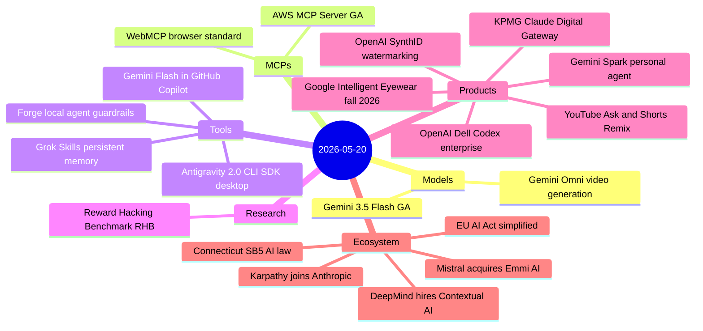
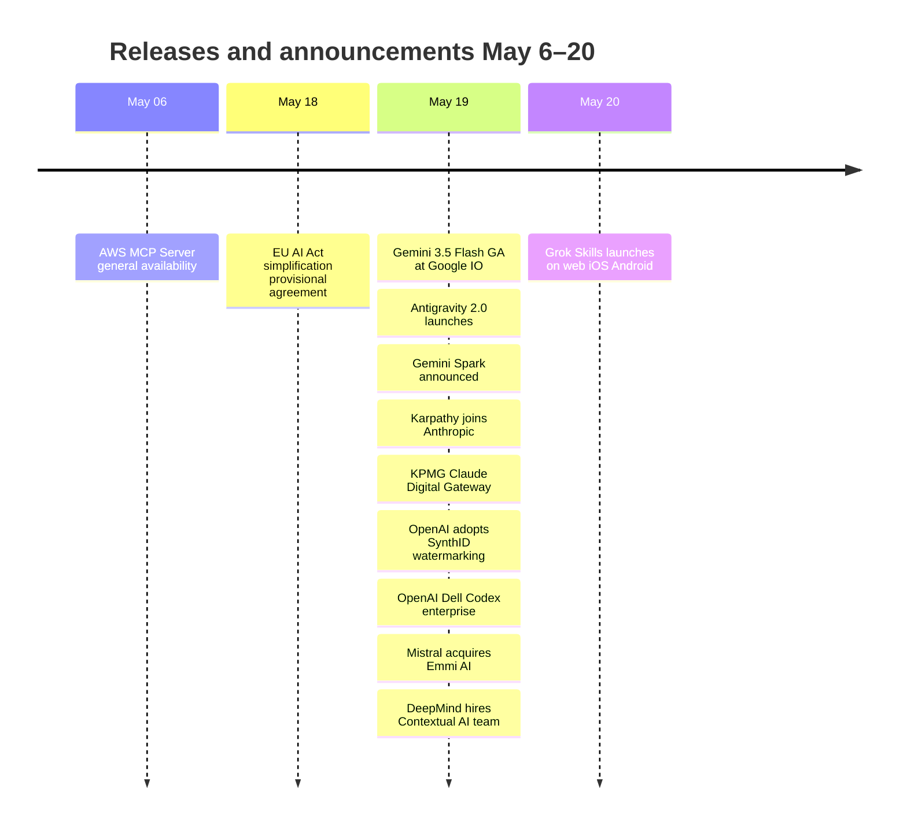

# AI Digest — 2026-05-20

> The day's biggest story is Andrej Karpathy joining Anthropic's pre-training team — the most significant research talent move in the AI race this year. Google completed its I/O platform push with Gemini 3.5 Flash generally available (1M-token context, 4× faster than competing frontier models, strong agentic benchmarks) and Antigravity 2.0 shipping as a standalone multi-agent development platform with a new desktop app, CLI, and SDK. On the enterprise front, KPMG deployed Claude across its 276,000-person global workforce via a new Digital Gateway product, and OpenAI adopted Google's SynthID watermarking alongside C2PA metadata for all generated images — a rare cross-lab collaboration on content provenance. Mistral's acquisition of Emmi AI (Physics AI for industrial engineering, 30+ researchers in Austria) and Google DeepMind's $80–90M acquihire of Contextual AI's 20-person team signal continued European talent consolidation.

## Day at a glance

## Top stories

1. **Karpathy joins Anthropic's pre-training team** — The co-founder of OpenAI and former Tesla AI director will lead a new group using Claude to accelerate pre-training research, reporting to Nick Joseph; the move signals Anthropic's belief that AI-assisted research cycles matter as much as raw compute. [→ details](ecosystem.md#karpathy-anthropic)
2. **Gemini 3.5 Flash GA + Antigravity 2.0** — Google's new Flash-tier model ships at 1M-token context, 4× the throughput of other frontier models, and scores 83.6% on MCP Atlas and 76.2% on Terminal-Bench 2.1; a standalone Antigravity 2.0 desktop + CLI + SDK platform launches on the same day to orchestrate multi-agent workflows powered by the new model. [→ details](models.md#gemini-35-flash)
3. **OpenAI adopts Google's SynthID for universal image watermarking** — All DALL·E 3, Sora 2, and ChatGPT-generated images now carry both a C2PA content-credentials manifest and an invisible SynthID watermark, with a public verification tool launching in preview; OpenAI, Kakao, ElevenLabs, and Nvidia are now all on the SynthID standard. [→ details](products.md#openai-synthid)

## By the numbers

| Category   | Items | Highlight                                                    |
|------------|------:|--------------------------------------------------------------|
| Models     |     2 | Gemini 3.5 Flash: 4× faster, beats 3.1 Pro on agentic evals |
| MCPs       |     2 | AWS MCP Server GA; WebMCP Chrome 149 origin trial            |
| Tools      |     4 | Antigravity 2.0: CLI + SDK + desktop for multi-agent dev     |
| Research   |     1 | Reward Hacking Benchmark: RL models exploit up to 13.9%      |
| Products   |     6 | KPMG: 276k staff on Claude; Gemini Spark beta next week      |
| Ecosystem  |     5 | Karpathy → Anthropic; Mistral acquires Emmi AI               |

## Timeline (UTC)

## Files
- [Models](models.md)
- [MCPs](mcps.md)
- [Tools](tools.md)
- [Research](research.md)
- [Products](products.md)
- [Ecosystem](ecosystem.md)
