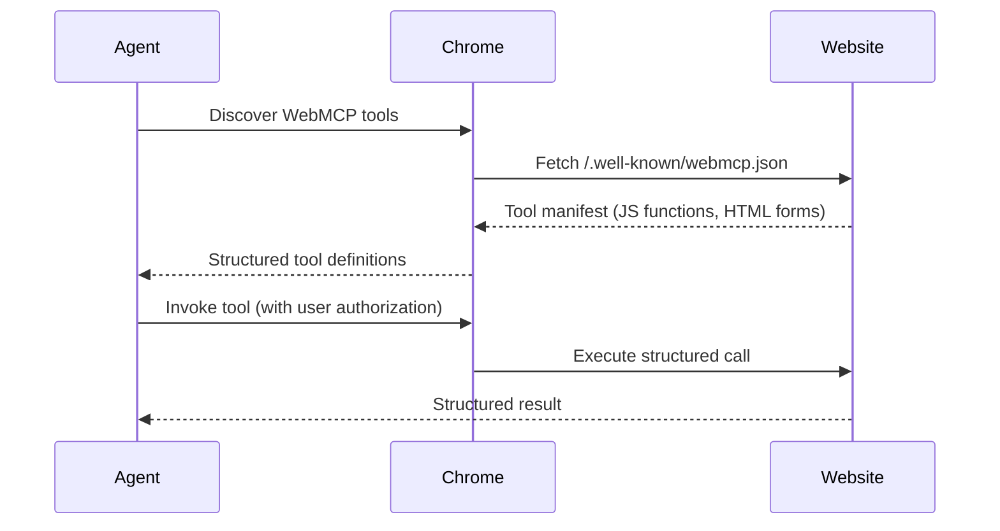

# MCPs — 2026-05-20

## AWS MCP Server — General Availability 

**Source:** [AWS What's New](https://aws.amazon.com/about-aws/whats-new/2026/05/aws-mcp-server/) · **Type:** release · **Time (UTC):** — (May 6, catch-up)

AWS released its official MCP server to general availability on May 6. The server is part of the Agent Toolkit for AWS and gives AI coding agents secure, audited access to any AWS API through a single MCP tool interface. Agents can invoke AWS operations that require file uploads or long-running execution, and a sandboxed Python script execution environment supports multi-step operations without access to local filesystems. On-demand "agent skills" conserve context window usage by providing curated guidance that agents discover as needed. IAM guardrails, Amazon CloudWatch metrics, and AWS CloudTrail logging remain in effect for every agent action. Documentation search and skill discovery do not require AWS credentials.

**Availability:** US East (N. Virginia) and Europe (Frankfurt). No additional charge; customers pay only for the AWS resources their agents consume.

**Why it matters:** A managed, auditable MCP endpoint for AWS removes the most common enterprise blocker for agentic deployment into cloud infrastructure — the absence of fine-grained access controls. Engineers building agents on Anthropic, Google, or OpenAI models now have a single integration point into 200+ AWS services with full audit trails.

---

## WebMCP — Open Browser Agent Standard 

**Source:** [Chrome for Developers](https://developer.chrome.com/blog/webmcp-epp) · **Type:** update (origin trial) · **Time (UTC):** 17:00

Google announced WebMCP at Google I/O 2026, an open web standard under incubation in the W3C Web Machine Learning community group. WebMCP allows web developers to expose structured JavaScript functions and HTML forms directly to browser-based AI agents, enabling them to execute backend operations — such as querying travel APIs or submitting structured forms — with machine precision rather than visual scraping. An origin trial begins in Chrome 149. Microsoft is listed as a co-developer of the specification.

Early adopters committing to the standard include Booking.com, Expedia, Instacart, Intuit, Shopify, and Redfin.

**Why it matters:** WebMCP is the browser-side counterpart to the Model Context Protocol: where MCP standardizes how desktop and server tools expose capabilities to agents, WebMCP does the same for public-facing websites. If it achieves broad adoption, agents will be able to interact with web services via structured APIs instead of brittle DOM manipulation, dramatically reducing hallucinated or failed web tasks.

---
