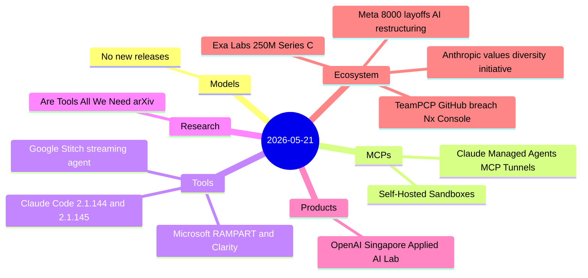
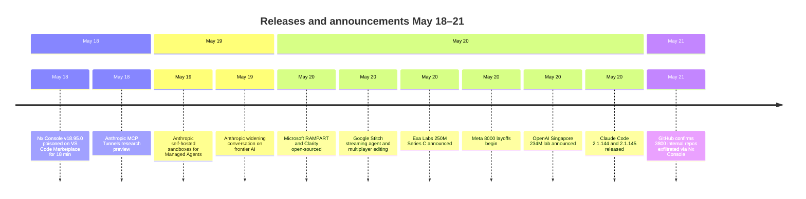

# AI Digest — 2026-05-21

> Three major stories define the day. Meta began notifying 8,000 employees (10% of its workforce) of layoffs starting May 20, explicitly framing the cuts as reallocation into $115–135B of AI infrastructure spending for 2026. In security, GitHub confirmed on May 21 that 3,800 internal repositories were exfiltrated by TeamPCP via a poisoned Nx Console VS Code extension — the latest in the group's cascading supply chain campaign that previously hit TanStack, Mistral AI, and OpenAI. OpenAI committed $234M to open its first applied AI lab outside the United States in Singapore. On the tooling side, Microsoft open-sourced RAMPART and Clarity for AI agent safety testing in CI/CD pipelines, and Exa Labs closed a $250M Series C at $2.2B to scale AI-native search infrastructure for agents. With Google I/O complete and the next model release cycle not yet underway, total item count is below the usual range.

## Day at a glance

## Top stories

1. **Meta begins 8,000-person layoff wave tied to AI spend** — 10% workforce reduction plus cancellation of 6,000 open roles, with the company directing savings toward $115–135B in AI infrastructure and reassigning 7,000 staff to new AI-focused engineering pods. [→ details](ecosystem.md#meta-layoffs)
2. **TeamPCP exfiltrates 3,800 GitHub internal repos via Nx Console** — A poisoned VS Code extension published for 18 minutes on May 18 harvested credentials from developer machines connected to the TanStack supply chain campaign; GitHub confirmed the breach on May 21 with no customer data exposed. [→ details](ecosystem.md#github-breach-nx-console)
3. **OpenAI commits $234M for first overseas AI lab in Singapore** — An applied AI lab employing 200+ technical staff, backed by an MOU with Singapore's MDDI, focusing on education, public services, healthcare, and digital infrastructure. [→ details](products.md#openai-singapore)

## By the numbers

| Category   | Items | Highlight |
|------------|------:|-----------|
| Models     |     0 | No new releases — post-I/O lull |
| MCPs       |     1 | Claude Managed Agents MCP Tunnels + self-hosted sandboxes |
| Tools      |     3 | RAMPART+Clarity; Stitch streaming agent; Claude Code patch |
| Research   |     1 | Tool-use efficiency analysis: costs of "tool tax" in agents |
| Products   |     1 | OpenAI Singapore: first overseas applied AI lab, $234M |
| Ecosystem  |     4 | Meta 8k layoffs; Exa $250M; GitHub breach; Anthropic values |

## Timeline (UTC)

## Files
- [Models](models.md)
- [MCPs](mcps.md)
- [Tools](tools.md)
- [Research](research.md)
- [Products](products.md)
- [Ecosystem](ecosystem.md)
