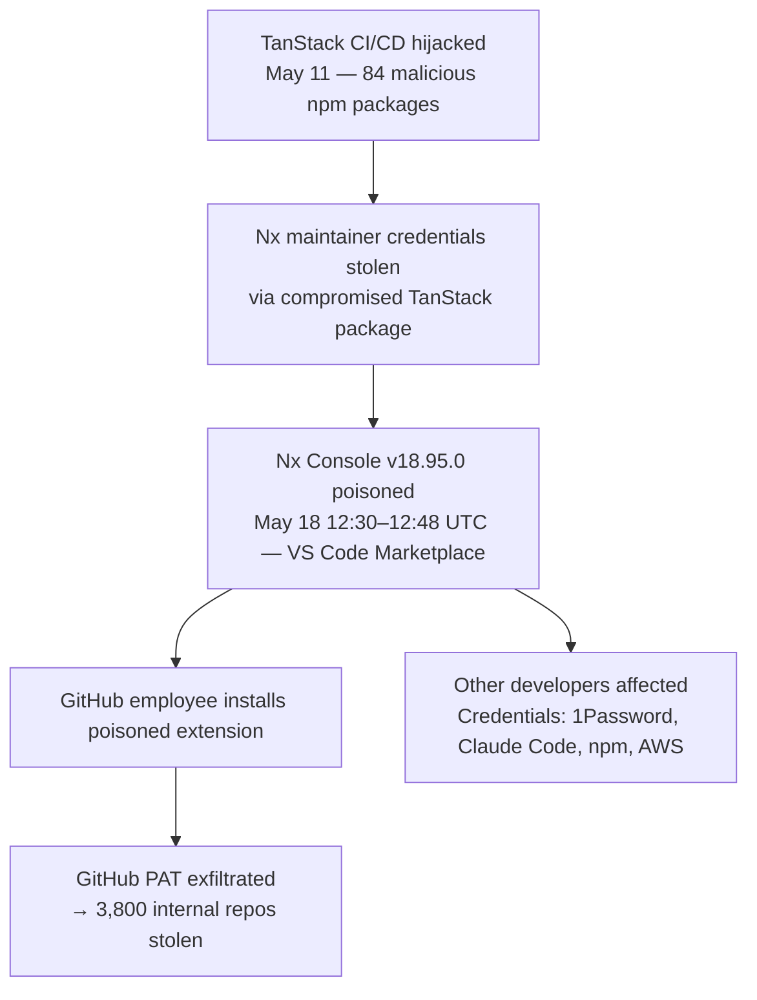

# Ecosystem — 2026-05-21

## Meta Begins 8,000-Person Layoff Wave 

**Source:** [The Next Web](https://thenextweb.com/news/meta-layoffs-may-2026-ai-restructuring-thousands) · [Tech Journal](https://techjournal.org/meta-layoffs-begin-8000-jobs-ai-spending) · **Type:** business · **Time (UTC):** May 20

Meta began notifying approximately 8,000 employees of layoffs on May 20, the first wave of a restructuring the company has explicitly framed as reallocation into AI. The cuts represent roughly 10% of Meta's 78,865-person workforce. An additional 6,000 open requisitions are being cancelled, bringing the effective headcount reduction to 14,000 positions.

Key structural details:
- **AI pivot:** Meta is spending $115–135B on AI infrastructure in 2026; Zuckerberg called this "the biggest infrastructure investment in the history of humanity" in an internal memo
- **Reassignments:** ~7,000 remaining workers are being moved into new AI-focused engineering pods — "Applied AI Engineering" and related divisions — to build autonomous workplace tools
- **Second wave:** Additional cuts are planned for H2 2026; scope and timing unconfirmed
- **Notification method:** Employees are receiving notifications by email rather than in-person meetings, a detail that generated significant press coverage

The current round is Meta's largest workforce reduction since the 2022–2023 "Year of Efficiency" campaign that eliminated ~21,000 roles.

**Why it matters:** Meta is the largest social-media company to execute an AI-driven structural workforce reduction rather than performance-based cuts. The explicit framing — layoffs fund AI capex — establishes a template other large tech companies may follow. For AI engineers, it signals continued strong demand for AI-native roles even as overall tech headcount contracts.

---

## Exa Labs Raises $250M at $2.2B Valuation 

**Source:** [Bloomberg](https://www.bloomberg.com/news/articles/2026-05-20/andreessen-backed-ai-search-startup-exa-valued-at-2-2-billion) · [SiliconAngle](https://siliconangle.com/2026/05/20/exa-labs-raises-250m-2-2b-valuation-ai-search-tools/) · **Type:** funding · **Time (UTC):** May 20

Exa Labs closed a $250M Series C led by Andreessen Horowitz, valuing the company at $2.2B — more than triple its $700M valuation from its previous round last fall. The company builds a proprietary AI-optimized web search API used by agentic systems rather than consumer-facing browsers.

Differentiator: Exa indexes the web using an embedding model trained specifically for semantic query matching, rather than wrapping an existing search engine (Google, Bing). Its flagship product, Exa Instant, returns structured results in under 180ms alongside full-text page retrieval (Contents) and multi-step search workflows (Exa Agent).

Customer base: 400,000+ developers, including Cursor, Cognition, HubSpot, and OpenRouter. The platform processes search requests for production agentic systems across coding, research, and workflow automation tasks.

Use of funds: Train next-generation search models and expand capacity to support hundreds of thousands of queries per second.

**Why it matters:** Exa occupies the search-as-infrastructure layer for the agentic application stack — the position that Google Search occupies for human-driven queries. The triple valuation in six months reflects investor conviction that agents will generate search volume large enough to support dedicated infrastructure. The a16z lead and $2.2B valuation put it squarely in "infrastructure company" territory, not "AI startup."

---

## TeamPCP Exfiltrates 3,800 GitHub Internal Repositories via Nx Console 

**Source:** [The Hacker News](https://thehackernews.com/2026/05/github-internal-repositories-breached.html) · [StepSecurity](https://www.stepsecurity.io/blog/nx-console-vs-code-extension-compromised) · **Type:** security · **Time (UTC):** May 21 (confirmed)

GitHub confirmed on May 21 that 3,800 of its internal source code repositories were exfiltrated after a developer's machine was compromised by a malicious VS Code extension. This is the latest escalation in a cascading supply chain campaign by TeamPCP (also tracked as UNC6780 by Google Threat Intelligence).

**Attack chain:**

1. **TanStack compromise (May 11):** TeamPCP hijacked TanStack's CI/CD pipeline via a GitHub Actions injection, publishing 84 malicious npm package versions across 42 packages with valid SLSA provenance. Credentials from developer machines running the compromised packages — including an Nx maintainer's system — were exfiltrated.

2. **Nx Console poisoning (May 18, 12:30–12:48 UTC):** Using credentials stolen from the Nx maintainer, TeamPCP published a trojanized Nx Console VS Code extension (nrwl.angular-console v18.95.0) to the Visual Studio Code Marketplace. The extension was live for exactly 18 minutes before Microsoft pulled it. On startup, it silently executed a shell command disguised as MCP setup work that stole credentials from 1Password vaults, Claude Code configurations, npm tokens, GitHub PATs, and AWS credentials.

3. **GitHub breach (May 18–21):** A GitHub employee using the poisoned extension had their GitHub tokens exfiltrated. Using those credentials, TeamPCP accessed and exfiltrated approximately 3,800 internal GitHub repositories.

GitHub's CISO stated there is "no evidence of impact to customer information stored outside of GitHub's internal repositories," though some support interaction content may have been exposed. The threat group is offering the stolen material for a reported $50,000 on underground forums.

Previously in the same campaign: Mistral AI npm and PyPI packages were compromised (May 11), OpenAI confirmed two employee devices were impacted, and UiPath packages were also trojanized.

**Why it matters:** This is the first publicly documented instance of a valid SLSA-provenance package being used as a supply chain attack vector, undermining one of the key trust signals developers use to evaluate npm packages. The attack chain — one compromised package leading to developer credentials leading to VS Code marketplace access leading to repository exfiltration — demonstrates that supply chain attacks can now compound across ecosystems (npm → VS Code Marketplace → GitHub) within days. Any developer who installed nrwl.angular-console between 12:30 and 12:48 UTC on May 18 should audit their credential stores immediately.

---

## Anthropic: Widening the Conversation on Frontier AI 

**Source:** [Anthropic](https://www.anthropic.com/news/widening-conversation-ai) · **Type:** policy/research · **Time (UTC):** May 19

Anthropic published a report on May 19 describing a structured dialogue program with thinkers from religious, philosophical, humanist, and civic traditions to inform Claude's moral character and value formation. The company has met with representatives from 15+ groups spanning diverse political and theological orientations.

The initiative is explicitly about "moral formation" — how Claude's values and behavioral defaults are shaped — rather than safety in the technical sense. Key findings from early experiments: giving Claude an ethical self-reflection mechanism (an internal "tool" it can call mid-task to reconsider its values) showed "markedly lower rates of misaligned behavior on several internal alignment evaluations."

Future expansion: legal scholars, psychologists, writers, and civic institutions will join the dialogue, with planned movement beyond moral formation toward questions about AI's effects on institutions and the distribution of power.

**Why it matters:** The experiment result — a simple self-reflection mechanism reducing misalignment on internal evals — is the most technically concrete disclosure in the report and has implications for alignment research: lightweight architectural additions (a reflective tool call) may supplement more expensive RLHF or Constitutional AI methods. The broader values dialogue is also notable as an acknowledgment that frontier labs cannot unilaterally define AI moral frameworks.

---
