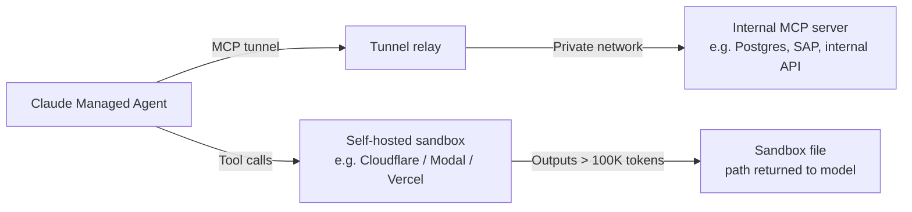

# MCPs — 2026-05-21

## Claude Managed Agents: MCP Tunnels and Self-Hosted Sandboxes 

**Source:** [Anthropic Platform Release Notes](https://platform.claude.com/docs/en/release-notes/overview) · **Type:** release · **Time (UTC):** May 19

Anthropic shipped two new Managed Agents capabilities on May 19, both under the existing `managed-agents-2026-04-01` beta header:

**MCP Tunnels (Research Preview)** allow Claude Managed Agents to connect to MCP servers running inside a private network — behind corporate firewalls or in isolated cloud VPCs — without exposing those servers publicly. The tunnel mechanism handles authentication and secure forwarding; configuration is declarative in the session spec.

**Self-Hosted Sandboxes** give enterprises an alternative to running agent tool execution on Anthropic's infrastructure. The initial set of supported sandbox providers includes Cloudflare, Daytona, Modal, and Vercel, with an API path for custom self-hosted environments. Operators gain full control over container runtime, networking egress, and secret injection.

Two related platform improvements shipped alongside: live updates to MCP server and tool configurations during an already-running session (no session restart required), and automatic file spill for tool outputs exceeding 100K tokens (the model receives a file path and truncated preview rather than failing or truncating silently).

**Why it matters:** MCP Tunnels eliminate the most common enterprise blocker for Managed Agents adoption — the requirement to expose internal services to Anthropic's infrastructure. Self-hosted sandboxes are the corresponding data-residency answer: regulated-industry customers who cannot route tool execution outside their own cloud boundary can now participate in the Managed Agents tier.

---
