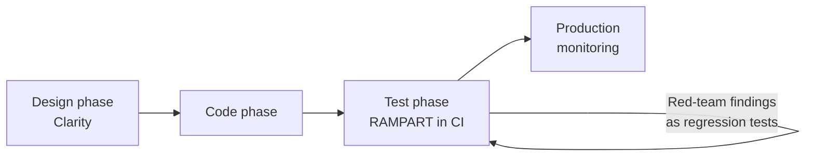

# Tools — 2026-05-21

## Microsoft RAMPART and Clarity 

**Source:** [Microsoft Security Blog](https://www.microsoft.com/en-us/security/blog/2026/05/20/introducing-rampart-and-clarity-open-source-tools-to-bring-safety-into-agent-development-workflow/) · **Type:** release · **Time (UTC):** May 20

Microsoft open-sourced two tools designed to bring AI safety into the development workflow rather than treating it as a periodic audit:

**RAMPART** (Risk Assessment and Measurement Platform for Agentic Red Teaming) is a pytest-native framework for writing and running safety and security tests against AI agents in CI/CD pipelines. It builds on PyRIT, Microsoft's existing generative AI red-team automation library, and adds composable evaluators for:
- Cross-prompt injection attacks (untrusted data from emails, files, or web pages manipulating agent behavior)
- Unintended action boundaries (tool invocations outside defined scope)
- Data exfiltration via agent side effects
- Behavioral regression across deployments

RAMPART represents tests as versioned pytest fixtures, making red-team findings permanent regression coverage rather than one-time findings.

**Clarity** is a structured design review tool that runs as a desktop app, web UI, or embedded agent. It guides teams through problem clarification, solution exploration, failure analysis, and decision tracking before code is written. Outputs are Markdown files committed to the repository, providing an audit trail of design rationale alongside the code itself. Multi-perspective failure analysis covers security, human factors, and operational angles simultaneously.

Both tools are available at `github.com/microsoft/RAMPART` and `github.com/microsoft/clarity-agent/`.

**Why it matters:** Most AI safety tooling today is oriented toward evaluation of finished models or post-deployment monitoring. RAMPART and Clarity shift the intervention point earlier — into the sprint — where fixing problems is orders of magnitude cheaper. For engineers shipping agentic systems, RAMPART provides a template for encoding adversarial scenarios as repeatable CI tests rather than one-off red-team exercises.

---

## Google Stitch — Streaming Design Agent and Multiplayer Editing 

**Source:** [Google Labs Blog](https://blog.google/innovation-and-ai/models-and-research/google-labs/stitch-updates/) · **Type:** release · **Time (UTC):** May 20

Google launched a significant update to Stitch, its AI-native UI design tool, at Google I/O 2026. Two new capabilities shipped simultaneously:

**Streaming Design Agent** replaces the previous turn-based prompt-and-wait workflow with a continuous model. The Stitch Agent renders UI components directly onto the canvas as the designer types or speaks, reflowing layouts in real time before generation completes. Mid-generation steering is supported — a designer can redirect ("make the navigation bar darker") while components are still rendering.

**Multiplayer Editing** adds simultaneous multi-user collaboration comparable to Google Docs. Multiple team members can work on the same canvas concurrently, resolving the major gap relative to Figma's collaborative workflow.

Additional capabilities in the update: voice commands ("show me three menu variants"), an Agent Manager that tracks design evolution and enables parallel direction exploration, direct export to Google AI Studio and Antigravity, and Netlify publishing.

Both features are available immediately to all global users at no cost. Stitch operates on two model tiers: Gemini 2.5 Flash (Standard mode) and Gemini 2.5 Pro (Experimental mode). No credit card required.

**Why it matters:** Stitch is Google's direct competitive response to Figma's professional tier ($15/editor/month). The streaming agent closes the latency gap that made turn-based AI design tools feel like waterfall, while zero-cost multiplayer removes the per-seat friction that has been Figma's main defensible moat.

---

## Claude Code 2.1.144 and 2.1.145 

**Source:** [Anthropic Platform Release Notes](https://platform.claude.com/docs/en/release-notes/overview) · **Type:** update · **Time (UTC):** May 20

Two Claude Code releases shipped on May 20:

**2.1.145** adds:
- `claude agents --json` for programmatic session listing (enables scripting of multi-agent orchestration)
- Enhanced plugin discovery that surfaces commands, agents, skills, hooks, and server metadata in a single call
- Fix for permission-prompt bypass when using Bash variable assignments
- Partial-view fallback in the Read tool when file content exceeds the token budget

**2.1.144** adds:
- Background session support for `/resume` with elapsed duration display
- Session-scoped model selection (press `d` to restore defaults) — avoids cross-contaminating model choices across sessions
- Startup hang fix when the API is unreachable; timeout reduced from unspecified to 15 seconds
- Terminal rendering corruption fix for extended sessions

**Why it matters:** The `--json` flag in 2.1.145 is the most directly useful addition for developers building CI/CD pipelines around Claude Code: it makes session enumeration scriptable without screen-scraping. The permission-prompt bypass fix addresses a security edge case where Bash variable assignments could sidestep the approval flow.

---
