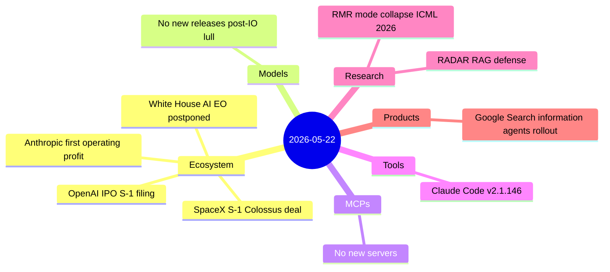
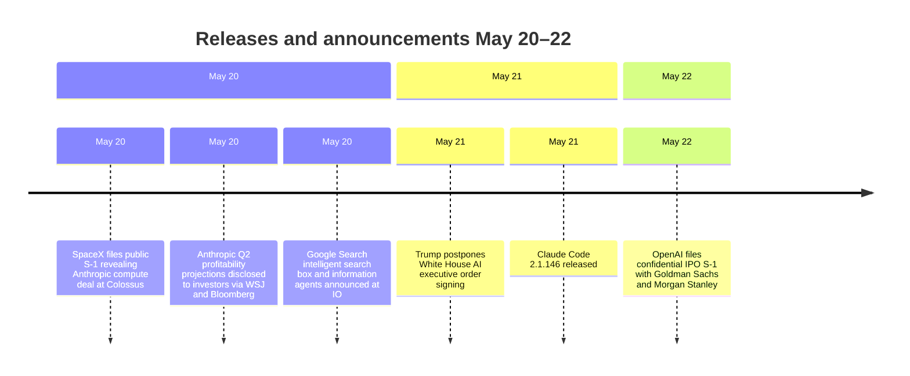

# AI Digest — 2026-05-22

> The day's biggest story is a financial doubleheader: OpenAI filed a confidential IPO prospectus with the SEC as early as today targeting a September listing at ~$852B, while Anthropic disclosed to investors that it expects its first-ever operating profit ($559M) on $10.9B of Q2 2026 revenue — a 130% jump from Q1. Underlying both stories is the SpaceX S-1 filed May 20, which revealed Anthropic is paying $1.25B per month for compute access to Colossus 1 and 2 through May 2029, a ~$45B contract that clarifies how Anthropic is financing frontier-scale training. On the policy front, President Trump postponed signing a White House AI executive order hours before the ceremony, citing internal disagreements about enforcement scope. With no new model releases, today is lighter than average — 8 items across four categories, dominated by ecosystem and financial developments.

## Day at a glance

## Top stories

1. **OpenAI files confidential IPO prospectus** — Goldman Sachs and Morgan Stanley submitted a draft S-1 to the SEC as early as May 22, targeting a September 2026 listing at ~$852B valuation with $25B in annualized revenue; the filing is confidential, so a public prospectus won't appear for approximately 60–90 days. [→ details](ecosystem.md#openai-ipo)
2. **Anthropic projects first operating profit ($559M) on $10.9B Q2 revenue** — A 130% quarter-over-quarter revenue jump from $4.8B in Q1, driven by Claude Code and enterprise security demand; compute costs dropped from 71¢ to 56¢ per revenue dollar, though full-year profitability is not guaranteed. [→ details](ecosystem.md#anthropic-profit)
3. **Trump postpones White House AI executive order** — The signing was called off hours before the May 21 ceremony; the draft would have created a voluntary pre-release sharing framework for frontier models, with internal White House disagreement between innovation-first and NSA-backed enforcement factions. [→ details](ecosystem.md#white-house-ai-eo)

## By the numbers

| Category   | Items | Highlight                                                    |
|------------|------:|--------------------------------------------------------------|
| Models     |     0 | Post-I/O lull — no new releases today                        |
| MCPs       |     0 | —                                                            |
| Tools      |     1 | Claude Code 2.1.146: /code-review replaces /simplify         |
| Research   |     2 | RMR: inference-time mode-collapse fix, ICML 2026 accepted    |
| Products   |     1 | Google Search information agents begin global rollout        |
| Ecosystem  |     4 | OpenAI IPO; Anthropic first profit; SpaceX S-1; EO delay     |

## Timeline (UTC)

## Files
- [Models](models.md)
- [MCPs](mcps.md)
- [Tools](tools.md)
- [Research](research.md)
- [Products](products.md)
- [Ecosystem](ecosystem.md)
