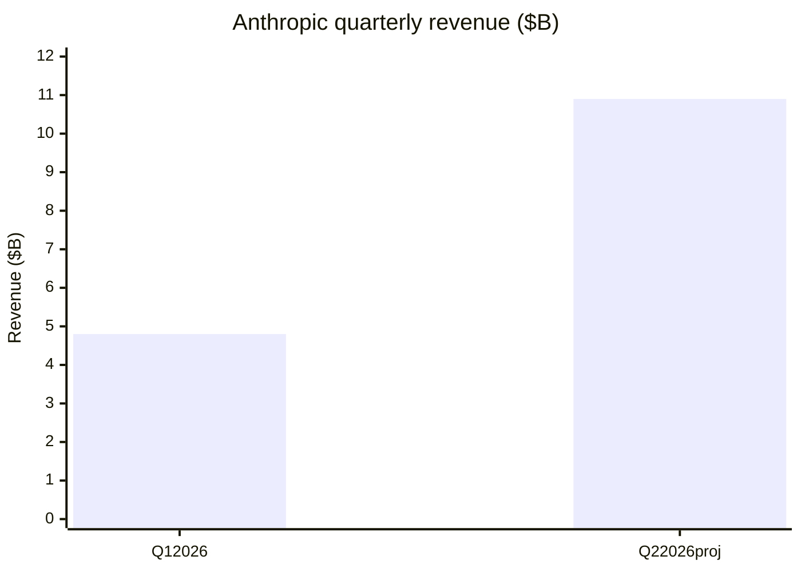
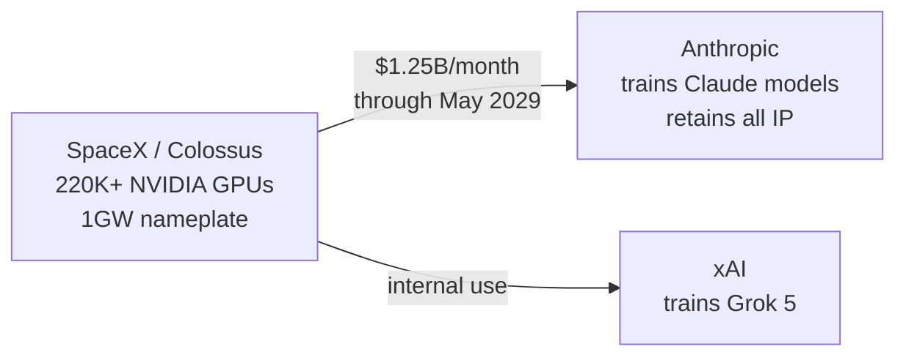

# Ecosystem — 2026-05-22

## OpenAI Files Confidential IPO Prospectus 

**Source:** [CNBC](https://www.cnbc.com/2026/05/20/openai-ipo-filing.html) · [Axios](https://www.axios.com/2026/05/20/openai-ipo-spacex-musk) · [Bloomberg](https://www.bloomberg.com/news/articles/2026-05-20/openai-preparing-for-ipo-filing-in-days-or-weeks-wsj-reports) · **Type:** business · **Time (UTC):** May 22

OpenAI submitted a confidential draft S-1 to the SEC as early as May 22, 2026, with Goldman Sachs and Morgan Stanley acting as lead underwriters; JPMorgan Chase is also involved in the deal. A confidential filing lets a company exchange regulatory comments with the SEC before public disclosure, meaning a public prospectus will not be visible for approximately 60–90 days from the submission date — placing the earliest readable S-1 in late July or August.

Key metrics cited in reporting:
- **Valuation:** ~$852B based on private-market secondary trades
- **Revenue (annualized):** ~$25B, driven by ChatGPT subscriptions, API, and the enterprise Codex tier
- **Target listing:** September 2026 on a U.S. exchange (exchange not yet confirmed)
- **Underwriters:** Goldman Sachs (lead), Morgan Stanley, JPMorgan Chase

The timing is directly competitive with SpaceX, which filed its own public S-1 on May 20 at a $1.75T valuation targeting a June 2026 Nasdaq listing under the ticker SPCX.

**Why it matters:** At ~$852B, OpenAI would debut as one of the largest technology IPOs ever by market cap. The confidential filing also triggers a countdown: once the public S-1 appears, rivals including Anthropic (targeting October at a reported $900B+) will face pressure to update or accelerate their own offering timelines. For engineers and AI companies, the IPO process will force OpenAI to disclose detailed financials — compute costs, model-specific revenue attribution, and inference margins — that have not been public before.

---

## Anthropic Projects First Operating Profit on $10.9B Q2 Revenue 

**Source:** [Bloomberg](https://www.bloomberg.com/news/articles/2026-05-20/anthropic-on-pace-for-first-profitable-quarter-as-revenue-surges) · [CNBC](https://www.cnbc.com/2026/05/20/anthropic-revenue-explosive-growth-ipo-profitable-quarter.html) · [Cryptobriefing](https://cryptobriefing.com/anthropic-first-profit-revenue-jump/) · **Type:** business · **Time (UTC):** May 20–21

Internal investor materials obtained by the Wall Street Journal and independently confirmed by Bloomberg show Anthropic projecting Q2 2026 revenue of $10.9B — a 130% quarter-over-quarter increase from the $4.8B it reported in Q1 — along with a first-ever operating profit of $559M.

Key financial details:
- **Q2 revenue projection:** $10.9B (+130% QoQ from $4.8B in Q1)
- **Operating profit projection:** $559M — first positive operating quarter since founding
- **Compute cost efficiency:** cost per revenue dollar declined from $0.71 (Q4 2025) to $0.56 (Q2 2026 estimate)
- **Primary growth driver:** Claude Code, now at over $1B in annualized revenue within roughly one year of general availability; enterprise cybersecurity also cited

Important caveat: Anthropic noted in the same materials that it does not expect to sustain full-year profitability due to planned compute spending increases, particularly the ramp-up of Colossus 2 GB200 (Blackwell Ultra) capacity throughout Q3 2026.

**Why it matters:** As recently as summer 2025, Anthropic told investors it did not expect a profitable full year until 2028. The $10.9B Q2 projection — if it holds — compresses that timeline by roughly six quarters and makes Anthropic's ~$900B fundraising valuation (Bloomberg, May 12) substantially more defensible. The decline in compute cost per revenue dollar (71¢ → 56¢) is also the clearest public data point on Anthropic's inference efficiency trajectory.

---

## SpaceX S-1 Reveals Anthropic–Colossus Compute Deal 

**Source:** [Axios](https://www.axios.com/2026/05/20/anthropic-spacex-compute) · [TechCrunch](https://techcrunch.com/2026/05/20/anthropic-will-pay-xai-1-25-billion-per-month-for-compute/) · [The VC Corner teardown](https://www.thevccorner.com/p/spacex-spcx-ipo-s1-teardown-valuation-2026) · **Type:** business · **Time (UTC):** May 20

SpaceX's public S-1 filing (May 20, $1.75T valuation target) disclosed that it signed a Cloud Services Agreement with Anthropic in May 2026, under which Anthropic pays $1.25B per month through May 2029 for reserved access to Colossus 1 and Colossus 2 — the AI compute infrastructure originally built by xAI. The contract is worth approximately $45B over its full term. Either party may terminate with 90 days' notice.

Technical scope of the deal:
- **GPUs:** 220,000+ NVIDIA chips, with Colossus 2 capacity expanding in May–June 2026 to include GB200 (Blackwell Ultra) hardware
- **Power draw:** 1GW+ nameplate at Colossus
- **Data rights:** Anthropic retains full ownership of its models, training data, and derived intellectual property
- **Concurrency:** SpaceX continues to train Grok 5 on the same infrastructure while renting spare capacity to Anthropic

The S-1 describes the Anthropic contract as "monetizing unused compute capacity," consistent with a spot-market compute arrangement rather than a dedicated facility. The 90-day termination clause confirms the opportunistic nature of the deal for both parties.

**Why it matters:** At $1.25B per month, the Colossus contract is by far the largest disclosed AI compute purchase in the industry's history — larger than any single hyperscaler deal on record. It directly explains how Anthropic is accessing frontier-scale training capacity without operating its own data centers, and why Anthropic's compute costs per revenue dollar have declined even as training runs scale. For the industry, this confirms that surplus AI compute at xAI's Colossus facility is now available on the open market, creating an alternative to AWS, Azure, and Google Cloud for frontier training.

---

## Trump Postpones White House AI Executive Order 

**Source:** [Washington Post](https://www.washingtonpost.com/wp-intelligence/ai-tech-brief/2026/05/21/ai-tech-brief-white-house-ai-order-now-postponed/) · [CNBC](https://www.cnbc.com/2026/05/21/trump-ai-executive-order-postponed.html) · [Bloomberg](https://www.bloomberg.com/news/articles/2026-05-21/white-house-postpones-ai-cybersecurity-order-signing-by-trump) · **Type:** policy · **Time (UTC):** May 21

President Trump postponed the signing of an AI executive order on May 21, hours before a scheduled ceremony. Trump publicly stated he "didn't like certain aspects of it" and expressed concern that the framework could slow the U.S. lead over China in AI development.

What the draft order contained:
- A **voluntary framework** under which frontier AI companies would share models with the U.S. government up to 90 days before public release, allowing federal agencies — including NSA — to evaluate security vulnerabilities
- **No statutory enforcement**: the draft relied on companies voluntarily opting in, with no penalties for non-participation
- **AI safety certification**: an optional government "cleared" designation for models that passed the pre-release review

The internal White House disagreement that caused the postponement centers on the enforcement mechanism. A pro-innovation faction (closer to the OSTP position) wanted the framework to remain genuinely voluntary with no government access mandates. A national security faction wanted classified NSA-backed testing with real enforcement, citing Anthropic's Mythos cybersecurity model as the direct motivating concern.

The executive order was previously previewed in the Trump administration's May 6 reversal on AI oversight ideas (Fortune), after months of resistance to any AI regulation.

**Why it matters:** The failed signing confirms that the U.S. still has no mandatory pre-release evaluation framework for frontier AI models — even a voluntary one. For frontier labs, this resolves a near-term compliance uncertainty, but it also means any regulatory framework that does emerge will likely be negotiated under more pressure from the next major incident rather than proactively. Colorado's SB 26-189 (effective June 30, 2026) and Connecticut's SB5 fill part of the state-level gap, but federal policy remains unresolved.

---
