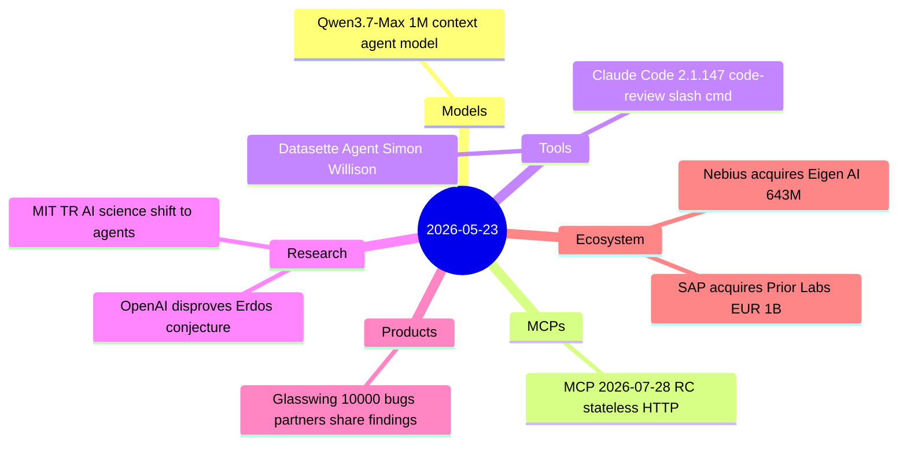
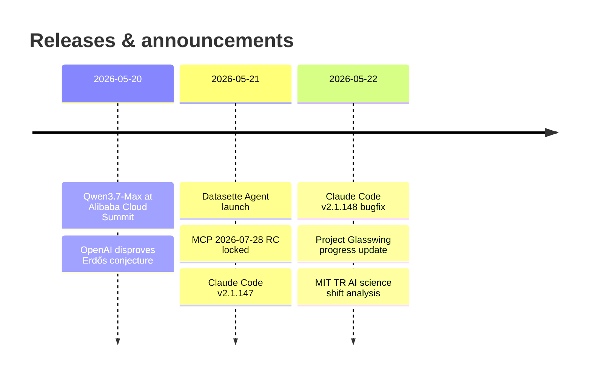

# AI Digest — 2026-05-23

> Today's digest is lighter than average (9 items) as the industry settles into the post–Google I/O lull, with no new model releases from frontier labs. The standout story is OpenAI's reasoning model autonomously disproving Erdős's 80-year unit distance conjecture — the first time AI has resolved a prominent open problem in pure mathematics, verified by Fields medalist Tim Gowers. The MCP working group locked its largest-ever protocol revision (stateless HTTP, Tasks, MCP Apps) with a final specification date of July 28. Two significant deals from earlier in May — Nebius's $643M acquisition of Eigen AI and SAP's €1B+ bet on tabular foundation models via Prior Labs — are covered here for the first time.

## Day at a glance

## Top stories

1. **OpenAI reasoning model disproves Erdős 80-year geometry conjecture** — An internal OpenAI model autonomously found infinite point-set constructions beating square grids via algebraic number theory, verified by Fields medalist Tim Gowers and Princeton's Will Sawin; the first AI to resolve a prominent open problem in pure mathematics. [→ details](research.md#openai-erdos-unit-distance)

2. **MCP 2026-07-28 Release Candidate locked** — The largest MCP revision since launch eliminates sessions from the protocol core, enabling stateless horizontal scaling on standard HTTP infrastructure; Tasks and MCP Apps graduate to official extensions. [→ details](mcps.md#mcp-rc-2026-07-28)

3. **Project Glasswing: 10,000+ critical bugs, partner sharing now permitted** — Six weeks into Anthropic's controlled security program, Mythos Preview has found over 10,000 high/critical vulnerabilities; Cloudflare (2,000 bugs) and Mozilla (271 Firefox fixes) lead partner results, and findings can now be published openly. [→ details](products.md#glasswing-update)

## By the numbers

| Category   | Items | Highlight |
|------------|------:|-----------|
| Models     |     1 | Qwen3.7-Max, 1M-token context, agent-first |
| MCPs       |     1 | Stateless RC locked, final spec July 28 |
| Tools      |     2 | Claude Code /code-review; Datasette Agent |
| Research   |     2 | Erdős disproof; AI science shift analysis |
| Products   |     1 | Glasswing 10k+ bugs, open sharing policy |
| Ecosystem  |     2 | Nebius $643M; SAP €1B+ tabular AI |

## Timeline (UTC)

## Files
- [Models](models.md)
- [MCPs](mcps.md)
- [Tools](tools.md)
- [Research](research.md)
- [Products](products.md)
- [Ecosystem](ecosystem.md)
