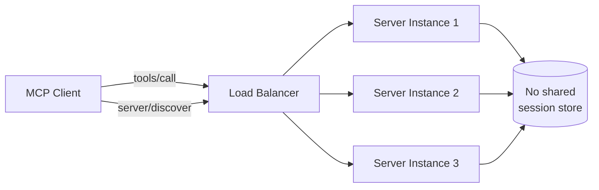

# MCPs — 2026-05-23

## MCP 2026-07-28 Release Candidate Locked 

**Source:** [Model Context Protocol Blog](https://blog.modelcontextprotocol.io/posts/2026-07-28-release-candidate/) · **Type:** update · **Time (UTC):** 2026-05-21 ~16:00

The MCP working group locked the release candidate for the next protocol specification on May 21, with the final spec scheduled for July 28. The headline change is full statelessness at the protocol layer: the `initialize` handshake and `Mcp-Session-Id` header are removed, letting any request land on any server instance behind a standard round-robin load balancer. Client metadata now travels in `_meta` on each request, and a new `server/discover` call replaces the handshake for capability negotiation. Two extensions graduate from experimental status: **Tasks** (a redesigned stateless lifecycle for long-running work, driven via `tasks/get`, `tasks/update`, and `tasks/cancel`) and **MCP Apps** (servers can ship interactive HTML UIs rendered in sandboxed iframes, with UI actions flowing through the same JSON-RPC audit path as direct tool calls). List responses gain `ttlMs` and `cacheScope` fields for client-side caching. Three existing features — Roots, Sampling, and Logging — enter 12-month sunset windows under a new formal deprecation policy. Tier 1 SDK maintainers have a 10-week validation window before the final specification publishes.

**Why it matters:** The stateless core removes the stickiest operational pain point in deploying MCP at scale — sticky sessions and shared session stores — making horizontal scaling trivially achievable on commodity HTTP infrastructure. The MCP Apps extension opens a path to server-bundled UI without breaking the auditability guarantees that enterprises require.

---
