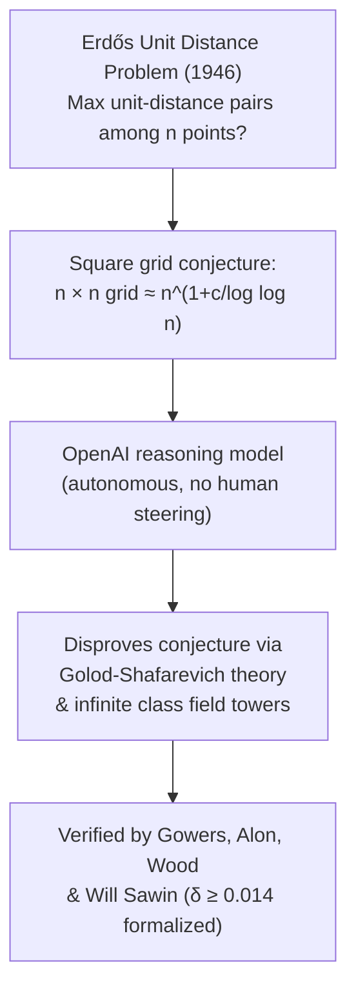

# Research — 2026-05-23

## OpenAI Reasoning Model Disproves Erdős Unit Distance Conjecture 

**Source:** [OpenAI](https://openai.com/index/model-disproves-discrete-geometry-conjecture/) · **Type:** research · **Time (UTC):** 2026-05-20 ~17:00

An unnamed internal OpenAI reasoning model autonomously disproved a central conjecture in discrete geometry that Paul Erdős posed in 1946. The problem asks: given *n* points in a plane, what is the maximum number of pairs at unit distance? For nearly 80 years the best-known construction was a square grid, and the conjecture held that grids were essentially optimal. The model discovered an infinite family of point sets using algebraic number theory — specifically Golod-Shafarevich theory and infinite class field towers — that beats the grid bound by an explicit polynomial factor (n^(1+δ), δ ≥ 0.014, per a follow-up paper by Will Sawin of Princeton). Fields medalist Tim Gowers and mathematicians Noga Alon (Princeton) and Melanie Wood independently verified the result. Sawin's paper formalizing the quantitative bound was published the same day.

**Why it matters:** This is the first time an AI system has autonomously resolved a prominent open problem in mathematics — not aided by a human telling it which sub-problems to pursue. Gowers calls it "a milestone in AI mathematics." The result signals that frontier reasoning models may be entering a regime where they contribute meaningfully to theoretical research, not just assist with it.

---

## AI-Driven Science Is Shifting From Specialized Tools to General Agents 

**Source:** [MIT Technology Review](https://www.technologyreview.com/2026/05/22/1137813/google-i-o-showed-how-the-path-for-ai-science-is-shifting/) · **Type:** analysis · **Time (UTC):** 2026-05-22

MIT Technology Review argues that Google I/O 2026 made visible a reorientation in AI-driven science: resources are flowing from narrow, domain-specific tools (AlphaFold, WeatherNext) toward general-purpose agentic systems. Evidence includes Nobel Prize–winning DeepMind researcher John Jumper now working on AI coding, Google packaging multiple LLM systems under "Gemini for Science" rather than releasing new specialized tools, and OpenAI's general-purpose reasoning model independently disproving the Erdős conjecture without domain-specific training. Demis Hassabis described the moment as "standing in the foothills of the singularity" at the I/O keynote.

**Why it matters:** If the science community's most capable tool shifts from bespoke models trained on domain data to agentic LLMs, it changes the build-vs-buy calculus for research software teams and raises questions about reproducibility, interpretability, and the long-term role of domain experts in shaping AI research directions.

---
