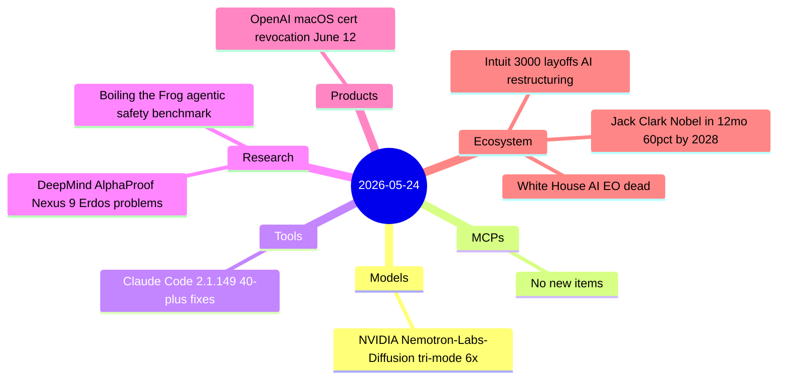
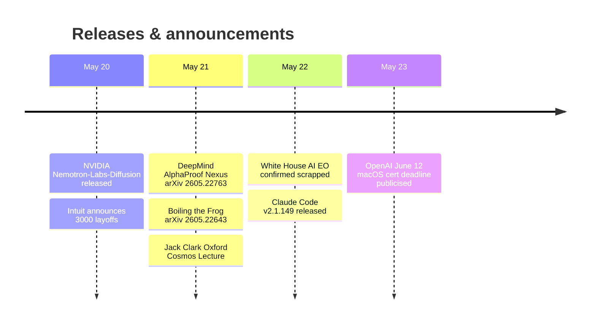

# AI Digest — 2026-05-24

> Today is quieter than average — 8 items across five categories, with no new frontier model releases. The most significant research development is DeepMind's AlphaProof Nexus resolving 9 open Erdős problems and 44 sequence conjectures via agentic Lean 4 proof-search loops, a systematic result that complements OpenAI's single-conjecture disproof from yesterday. On policy, the White House AI executive order is now confirmed dead rather than postponed, after direct CEO lobbying by Musk, Zuckerberg, and Sacks killed a voluntary pre-deployment review framework before it reached signature. NVIDIA shipped Nemotron-Labs-Diffusion, the first commercially-licensed tri-mode LM combining autoregressive, diffusion, and self-speculation decoding in one checkpoint at 6× the throughput of Qwen3-8B.

## Day at a glance

## Top stories

1. **DeepMind AlphaProof Nexus resolves 9 open Erdős problems** — A day after OpenAI disproved the unit-distance conjecture, DeepMind posted an arXiv paper showing AlphaProof Nexus autonomously resolving 9 out of 353 open Erdős combinatorics problems and proving 44 OEIS sequence conjectures; the method uses simple agentic LLM loops around a Lean 4 checker with no specialized per-problem training. [→ details](research.md#deepmind-alphaproof-nexus)

2. **White House AI executive order confirmed dead** — Reporting from Semafor and Axios confirms the voluntary pre-deployment model review framework was scrapped outright (not merely postponed) after Musk, Zuckerberg, and Sacks each called Trump directly; the U.S. now has no active federal AI evaluation pathway. [→ details](ecosystem.md#white-house-ai-eo-dead)

3. **NVIDIA Nemotron-Labs-Diffusion: tri-mode, 6× throughput** — A single checkpoint supporting autoregressive, diffusion, and self-speculation inference; the 8B text model reaches 6.4× tokens per forward pass over Qwen3-8B in quadratic self-speculation mode, commercially licensed. [→ details](models.md#nvidia-nemotron-labs-diffusion)

## By the numbers

| Category   | Items | Highlight |
|------------|------:|-----------|
| Models     |     1 | NVIDIA Nemotron-Labs-Diffusion: tri-mode, 3B/8B/14B + VLM |
| MCPs       |     0 | — |
| Tools      |     1 | Claude Code 2.1.149: /usage categories, security hardening |
| Research   |     2 | AlphaProof Nexus, Boiling the Frog safety benchmark |
| Products   |     1 | OpenAI macOS cert revocation — action required by June 12 |
| Ecosystem  |     3 | EO dead, Intuit 17% layoffs, Jack Clark Nobel prediction |

## Timeline (UTC)

## Files
- [Models](models.md)
- [MCPs](mcps.md)
- [Tools](tools.md)
- [Research](research.md)
- [Products](products.md)
- [Ecosystem](ecosystem.md)
