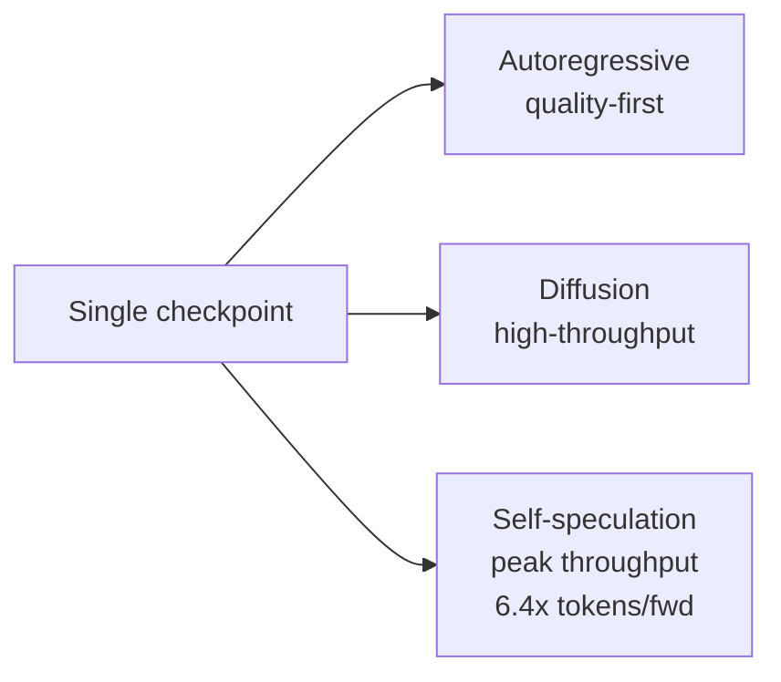

# Models — 2026-05-24

## NVIDIA Nemotron-Labs-Diffusion 

**Source:** [NVIDIA Research](https://research.nvidia.com/publication/2026-05_nemotron-labs-diffusion-tri-mode-language-model-unifying-autoregressive) · [HuggingFace Blog](https://huggingface.co/blog/nvidia/nemotron-labs-diffusion) · **Type:** release · **Time (UTC):** 2026-05-20

Nemotron-Labs-Diffusion is a family of language models trained jointly on an autoregressive (AR) and masked-diffusion objective, enabling three distinct inference modes within a single checkpoint: (1) autoregressive for standard quality-first use cases; (2) diffusion for high-throughput batch generation; and (3) self-speculation — linear or quadratic — where the model drafts and verifies its own tokens for peak throughput. The 8B text model reaches 5.9× more tokens per forward pass than Qwen3-8B in diffusion mode, rising to 6.0× (linear self-speculation) and 6.4× (quadratic), translating to 4× higher end-to-end throughput on SPEED-Bench with SGLang on an NVIDIA GB200. The collection covers text models at 3B, 8B, and 14B, plus an 8B vision-language model, all released under the commercially permissive NVIDIA Nemotron Open Model License.

**Why it matters:** Diffusion inference is batch-friendly and breaks the autoregressive per-token latency ceiling for throughput-limited deployments — large-context coding agents, batch document processing, high-concurrency API serving. The single-checkpoint design means operators can switch modes per request without managing separate model files.

| Family | Sizes | Modes | License |
|--------|-------|-------|---------|
| Text | 3B, 8B, 14B | AR · Diffusion · Self-speculation | Nemotron Open |
| VLM | 8B | AR · Diffusion · Self-speculation | Nemotron Open |

---
