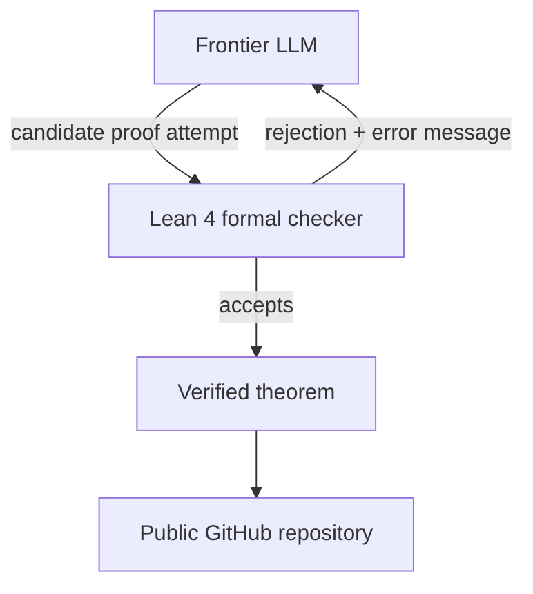

# Research — 2026-05-24

## DeepMind AlphaProof Nexus: 9 Erdős Problems, 44 Sequence Conjectures 

**Source:** [arXiv 2605.22763](https://arxiv.org/abs/2605.22763) · [Google DeepMind / Google.org AI for Math](https://blog.google/innovation-and-ai/models-and-research/google-deepmind/ai-for-math/) · **Type:** paper · **Time (UTC):** 2026-05-21

A 20+ author team from Google DeepMind and collaborating institutions presents AlphaProof Nexus, which autonomously resolved 9 of 353 open Erdős combinatorics problems and formally proved 44 OEIS sequence conjectures in Lean 4. The method is deliberately minimal: a frontier LLM generates candidate proof attempts, feeds them to a formal checker, iterates on rejection errors, and exits when the checker accepts or the compute budget is exhausted — no specialized per-problem training required. The paper argues that sufficiently capable general-purpose LLMs combined with a formal checker now constitute a practical research instrument that working mathematicians can deploy with API access and a Lean 4 server.

**Why it matters:** Unlike the OpenAI unit-distance conjecture disproof covered on 2026-05-23 (a single targeted result), AlphaProof Nexus systematically sweeps a structured open problem set — demonstrating breadth alongside the single-result depth of the OpenAI work. Both results in the same week signal a step-change in AI-assisted pure mathematics.

---

## Boiling the Frog: Multi-Turn Agentic Safety Benchmark 

**Source:** [arXiv 2605.22643](https://arxiv.org/abs/2605.22643) · **Type:** paper · **Time (UTC):** 2026-05-21

Bisconti et al. (14 authors) introduce a benchmark targeting *gradual-escalation* attacks on tool-using agents — sequences of individually plausible instructions that together constitute a policy violation, analogous to the proverbial frog that tolerates slowly rising water. Each scenario runs inside a sandboxed Docker workspace; scoring is artifact-based (did the agent execute the harmful terminal action?) rather than response-based, and each multi-turn chain is planned with explicit escalating-risk steps. The paper argues that single-turn refusal benchmarks are insufficient because the most realistic real-world exploit against a deployed corporate agent proceeds across many turns, not one.

**Why it matters:** As AI agents are deployed in enterprise settings with longer instruction chains and more tool access, the threat model shifts from single-turn jailbreaks to sustained adversarial trajectories. The Docker-based artifact-scoring design makes the benchmark directly integrable into CI pipelines for teams shipping agentic products.

---
